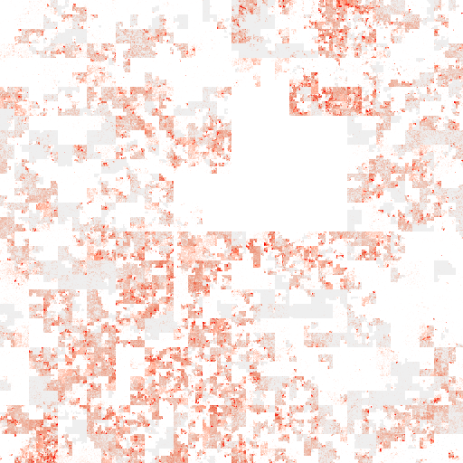

<!--
%\VignetteEngine{knitr}
%\VignetteIndexEntry{Making 2D Hilbert Curve}
-->

Making 2D Hilbert Curve
========================================

**Author**: Zuguang Gu ( z.gu@dkfz.de )

**Date**: `r Sys.Date()`

-------------------------------------------------------------

```{r, echo = FALSE, message = FALSE}
library(markdown)
options(markdown.HTML.options = c(options('markdown.HTML.options')[[1]], "toc"))

library(knitr)
knitr::opts_chunk$set(
    error = FALSE,
    tidy  = FALSE,
    message = FALSE,
    fig.align = "center",
    fig.width = 6,
    fig.height = 6)
options(markdown.HTML.stylesheet = "custom.css")

options(width = 100)

# if it is on the cluster, chunks that need long time will run when generating
# the vignette
on_cluster = grepl("tbi", Sys.info()["nodename"]) & Sys.info()["user"] == "guz"
library(HilbertCurve)
```

[Hilbert curve](https://en.wikipedia.org/wiki/Hilbert_curve) is a type of space-filling curves
that folds one dimensional axis into a two dimensional space, but with still keeping the locality.
It has advantages to visualize data with long axis in following two aspects:

1. greatly improve resolution of the visualization;
2. easy to visualize clusters because generally data points in the axis will also be close in the 2D space. 

This package aims to provide an easy and flexible way to visualize data through Hilbert curve.
The implementation and example figures are based on following sources:

- http://mkweb.bcgsc.ca/hilbert/
- http://corte.si/posts/code/hilbert/portrait/index.html
- http://bioconductor.org/packages/devel/bioc/html/HilbertVis.html

```{r}
library(HilbertCurve)
library(circlize)
set.seed(12345)
```

Following shows Hilbert curve with level 2, 3, 4, 5:

```{r, fig.width = 12, fig.height = 3, echo = FALSE}
grid.newpage()
pushViewport(viewport(layout = grid.layout(nr = 1, nc = 4)))
pushViewport(viewport(layout.pos.row = 1, layout.pos.col = 1))
HilbertCurve(1, 100, level = 2, reference = TRUE, newpage = FALSE, title = "level = 2")
upViewport()
pushViewport(viewport(layout.pos.row = 1, layout.pos.col = 2))
HilbertCurve(1, 100, level = 3, reference = TRUE, newpage = FALSE, title = "level = 3")
upViewport()
pushViewport(viewport(layout.pos.row = 1, layout.pos.col = 3))
HilbertCurve(1, 100, level = 4, reference = TRUE, newpage = FALSE, title = "level = 4")
upViewport()
pushViewport(viewport(layout.pos.row = 1, layout.pos.col = 4))
HilbertCurve(1, 100, level = 5, reference = TRUE, reference_gp = gpar(col = "grey"), 
    arrow = FALSE, newpage = FALSE, title = "level = 5")
upViewport()
upViewport()
```

As shown in the above plots, as level increases, the length of the curve becomes longer and the curve folds
more tensely. The number of segments on the Hilbert curve is `4^level - 1`. If a Hilbert curve with level 11 
is used to map to human chromosome 1, the resolution would be `249250621/4^11` (approximately 60bp).

*Note: for the Hilbert curve which is actually made by HilbertVis package, the axis always starts from left 
bottom side and ends at the right bottom side.*

Following heatmap shows the distance between elements in the Hilbert curve. From left to right
and from top to bottom, the order is the natural order of data points on the axis and colors represent 
the pairwise distance in the 2D space.
Basically, if data points are close in the one dimensional axis, they also have small 
distance in the 2D space (regions around diagonals). There are some data points in [1, 256]
which are close to the data points in [768, 1024], but it is only because the curve folds back and
it can easily be distinguished once you are clear with the structure of the curve.

```{r, fig.width = 7}
library(HilbertVis)
pos = HilbertVis::hilbertCurve(5)
mat = as.matrix(dist(pos))
library(ComplexHeatmap)

ht = Heatmap(mat, name = "dist", cluster_rows = FALSE, cluster_columns = FALSE, 
    show_row_names = FALSE, show_column_names = FALSE, 
    heatmap_legend_param = list(title = "euclidean_dist"))
draw(ht, padding = unit(c(5, 5, 5, 2), "mm"))
decorate_heatmap_body("dist", {
    grid.segments(c(0.25, 0.5, 0.75, 0, 0, 0), c(0, 0, 0, 0.25, 0.5, 0.75), 
	      c(0.25, 0.5, 0.75, 1, 1, 1), c(1, 1, 1, 0.25, 0.5, 0.75), gp = gpar(lty = 2))
    grid.text(rev(c(256, 512, 768, 1024)), 0, c(0, 256, 512, 768)/1024, just = "bottom", 
        rot = 90, gp = gpar(fontsize = 10))
    grid.text(c(1, 256, 512, 768, 1024), c(1, 256, 512, 768, 1024)/1024, 1, just = "bottom",
        gp = gpar(fontsize = 10))
})
```

## Basic settings

The **HilbertCurve** package provides a rather simple way to display the data in the form of Hilbert
curve. It hides all the technical parts and users only need to think that they are adding graphics on a novel axis
based on specifying positions.

Generally, customizing a Hilbert curve follows following steps:

```{r, eval = FALSE}
hc = HilbertCurve(...)  # initialize the curve
hc_points(hc, ...)      # add points 
hc_rect(hc, ...)        # add rectangles
hc_segments(hc, ...)    # add lines
hc_text(hc, ...)        # add text
```

`HilbertCurve()` is a constructor function and initializes the Hilbert curve. Following
example means initializing a Hilbert curve with level 4 which maps data ranging from 1 to 100
The function returns a `HilbertCurve` class instance and it can be used to add more graphics later.

`reference` arguments here is only used to show the structure of the curve.

```{r, eval = FALSE}
hc = HilbertCurve(1, 100, level = 4, reference = TRUE)
```

The curve can be though as a folded axis. When the coordinate for this folded axis is
initialized, low-level graphics can be added with specifying the positions.

There are several ways to specify the "positions" of the data points. First let's generate 
a random regions by **IRanges** package.

```{r}
x = sort(sample(100, 20))
s = x[1:10*2 - 1]
e = x[1:10*2]
ir = IRanges(s, e)
ir
```

Here `ir` contains intervals which are composed by positive integers. In later sections, 
you will see negative and numeric intervals are supported as well.

### Points

There are two modes for adding points. Normally, width of intervals are always long in the curve and can not be sufficiently
represented by single points, thus, by default, every interval mapped to the Hilbert curve are segmented
into several tiny segments and a circle is plotted for every tiny segments.

```{r}
hc = HilbertCurve(1, 100, level = 4, reference = TRUE)
hc_points(hc, ir)
```

The number of circles used to represent the intervals can be controlled by `np` (number of points per segment).
`np` controls number of tiny segments for every Hilbert curve segment (e.g. the first horizontal segment in the left bottom in the curve).
Graphic parameters can be set by `gp`. Note under this mode, the size of points can only be changed by `np` argument.
To make it more interesting, you can choose different shapes for the points. There are some pre-defined shapes
that you can choose from: "circle", "square", "triangle", "hexagon", "star".

```{r}
hc = HilbertCurve(1, 100, level = 4, reference = TRUE)
hc_points(hc, ir, np = 3, gp = gpar(fill = rand_color(length(ir))),
    shape = sample(c("circle", "square", "triangle", "hexagon", "star"), length(ir), replace = TRUE))
```

In above figure, you may notice for some intervals, the color is more light in the ends. This is because the interval represented
by the circle in the end is not fully covered by user's interval, thus, averaging is applied here. E.g. if only
the half interval represented by the circle is covered by user's interval and the color for this circle is set to red,
then after the averaging, the color would be semi-red (#FF8080). Averaging is very important when you visualize
the genome with zooming and you can find more detailed explanation in the **Averaging** section.

If `np` is set to 1 or `NULL`, the points will be plotted at the center of every interval in `ir`.
In this case, `size` argument is used to control the size of the points. This mode is useful
if you have a lot of small regions.

```{r}
hc = HilbertCurve(1, 100, level = 4, reference = TRUE)
hc_points(hc, ir, np = NULL, size = unit(runif(length(ir)), "cm"), pch = 16)
```

### Segments

Adding segments is straightforward. 

```{r}
hc = HilbertCurve(1, 100, level = 4, reference = TRUE)
hc_segments(hc, ir, gp = gpar(lwd = 5))
```

### Rectangles

Adding rectangles is straightforward. Note You cannot set the width or height of the rectangles. 
They are fixed and more like pixel-style squares. If you really want to use rectangles with different
length to represent the intervals, you can use `hc_segments()` by setting proper `lwd` value (see
the example of RefSeq genes in later sections).

```{r}
hc = HilbertCurve(1, 100, level = 4, reference = TRUE)
hc_rect(hc, ir, gp = gpar(fill = "#FF000080"))
```

As you can see some rectangles are not full red as well. It is also because of averaging. See **Averaging** 
sections for explanation.

### Text

Adding texts is straightforward. Text is always added at the center of each interval in `ir`.

```{r}
hc = HilbertCurve(1, 100, level = 4, reference = TRUE)
labels = sample(letters, length(ir), replace = TRUE)
hc_text(hc, ir, labels = labels, gp = gpar(fontsize = width(ir)*2+5))
```

### Averaging

**Note: this "averaging" concept is very important. If you have unexpected plot, try other `mean_mode` option.**

Graphic parameters that correspond to `ir` are always represented as numeric values, such as size of points,
width of lines or even colors which can be converted to numeric RGB values. If a segment in the Hilbert
curve can not full overlap with some intervals in `ir`, these numeric parameters will be averaged.

There are three different modes for averaging which are controlled by `mean_mode` argument.
Following illustrates different settings for `mean_mode`:

```
      100     80    60     values in ir (e.g. red compoment for colors)
    ++++++   +++   +++++   ir
      ================     window (width = 16)
       4      3     3      overlap

    absolute: (100 + 80 + 60)/3
    weighted: (100*4 + 80*3 + 60*3)/(4 + 3 + 3)
    w0:       (100*4 + 80*3 + 60*3)/16
```

So use of the mode depends on specific scenario. For example, if `ir` corresponds to positions of genes,
then the mode of `w0` is perhaps a good choise. If `ir` corresponds to positions of CpG sites which is
has width of 1 and most of the time it is relatively sparse in the genomic windows, then `absolute` is a correct choice.

### Combine low-level functions

With combination of these basic low-level graphic functions, complicated graphics can be easily made:

```{r}
hc = HilbertCurve(1, 100, level = 4)
hc_segments(hc, IRanges(1, 100))   # This is an other way to add background line
hc_rect(hc, ir, gp = gpar(fill = rand_color(length(ir), transparency = 0.8)))
hc_points(hc, ir, np = 3)
hc_text(hc, ir, labels = labels, gp = gpar(fontsize = 16, col = "blue"))
```

## Non-integer positions

It doesn't matter if your positions are integers or not. Internally, adjustment are automatically applied.

When positions are not integers, you can specify the positions by `x1` and `x2`. 
All low-level graphical funtions accept `x1` and `x2`.

```{r}
hc = HilbertCurve(0.1, 0.8, level = 4, reference = TRUE)
hc_points(hc, x1 = c(0.15, 0.55), x2 = c(0.25, 0.65))
```

This is also useful to specify the positions with huge values which can not be represented by the `IRagnes` class (e.g. the summation of total length of human chromosomes).

```{r}
# code not run when generating the vignette
hc = HilbertCurve(1, 1000000000000, level = 4, reference = TRUE)
hc_points(hc, 400000000000, 600000000000)
```

Negative positions are allowed as well.

```{r}
hc = HilbertCurve(-100, 100, level = 4, reference = TRUE)
hc_points(hc, x1 = -50, x2 = 50)
```

## Add title and legends

Title can be set by the `title` argument. 
Legend can be passed to `legend` argument in `HilbertCurve()` as a `grob` object or a list of `grob` objects.
Basically, colors are the main aesthetic mappings to values, thus, `ColorMapping` class in **ComplexHeatmap** package 
can be very helpful to create a legend `grob`. Also you can consider `legendGrob()` in **grid** package.

Because width and height are enforced to be equal for the Hilbert curve, sometimes you may see blank spaces around
the curve.

```{r}
value = runif(length(ir))
col_fun = colorRamp2(c(0, 1), c("white", "red"))
cm1 = ColorMapping(col_fun = col_fun)
legend1 = color_mapping_legend(cm1, plot = FALSE, title = "continuous")

cm2 = ColorMapping(levels = c("A", "B"), color = c("#00FF0080", "#0000FF80"))
legend2 = color_mapping_legend(cm2, plot = FALSE, title = "discrete")

legend = list(legend1, legend2)

hc = HilbertCurve(1, 100, reference = TRUE, title = "points", legend = legend)
hc_points(hc, ir, np = 3, gp = gpar(fill = col_fun(value)))
hc_rect(hc, ir, gp = gpar(fill = sample(c("#00FF0020", "#0000FF20"), length(ir), replace = TRUE)))
```

## Pixel mode

The pixel mode can be thought as a high resolution version of `hc_rect()`.
When the level is high (e.g. > 10), the whole 2D space will be almost completely filled by the curve and
it is impossible to add or visualize e.g. points on the curve. In this case, the 'pixel'
mode visualizes each tiny 'segment' as a pixel and maps values to colors. So the Hilbert
curve with level 11 will generate a PNG figure with resolution of 2048x2048. This is extremely
useful for visualize genomic data. E.g. If we make a Hilbert curve for human chromosome 1 with
level 11, then each pixel can represent about 60bp (``249250621/2^11/2^11``) which is of very high resolution.

Under 'pixel' mode, every time a new layer is added, 
the image will be add to the interactive device as a rastered image. 

```{r}
hc = HilbertCurve(1, 100, level = 9, mode = "pixel")
hc_layer(hc, ir)
```

Since color is only used to map to values, there is only one graphic setting `col`. 
You can add more than one layers, and just remember to set transparent colors for the additional layers. 
And of course you can add title and legend to the plot.

```{r}
hc = HilbertCurve(1, 1000, level = 9, mode = "pixel", title = "pixel mode")
x = sample(1000, 100)
hc_layer(hc, x1 = x, x2 = x+5, mean_mode = "absolute")
hc_layer(hc, x1 = 750, x2 = 850, col = "#0000FF20")
```

Grid lines can be added to the plot for better distinguish blocks in the Hilbert curve.
The 2D space will be split into `2^(grid_line-1)` rows and `2^(grid_line-1)` columns.

```{r}
hc = HilbertCurve(1, 100, level = 9, mode = "pixel")
hc_layer(hc, ir, grid_line = 3)
```

The Hilbert curve can be save as PNG figure by `hc_png()` with resolution `2^level x 2^level`.
Note only the curve itself is exported.

```{r, eval = FALSE}
# code not run, only for demonstration
hc_png(hc, file = "test.png")
```

## Examples

Visualize rainbow colors:

```{r}
col = rainbow(100)
hc = HilbertCurve(1, 100, level = 5)
hc_points(hc, x1 = 1:99, x2 = 2:100, np = 3, gp = gpar(col = col, fill = col))
```

or use the rectangles:

```{r}
hc = HilbertCurve(1, 100, level = 5)
hc_rect(hc, x1 = 1:99, x2 = 2:100, gp = gpar(col = col, fill = col))
```

Reproduce [http://datadrivensecurity.info/blog/posts/2015/Jan/mapping-ipv4-address-in-hilbert-space/](the visualization for IPv4 address). The CIDR data is from http://www.iwik.org/ipcountry/.

```{r, fig.width = 8, fig.height = 7}
library(ComplexHeatmap)
library(RColorBrewer)

load(system.file("extdata", "cidr_list.RData", package = "HilbertCurve"))

cidr_list = cidr_list[sapply(cidr_list, length) > 0]

country = rep(names(cidr_list), times = sapply(cidr_list, length))

ip = unlist(cidr_list, "r")

# convert ip address to numbers
mat = t(as.matrix(data.frame(lapply(strsplit(ip, "\\.|/"), as.numeric))))
start = mat[, 1]*256^3 + mat[, 2]*256^2 + mat[, 3]*256 + mat[, 4]
width = sapply(mat[, 5], function(x) strtoi(paste(rep(1, 32 - x), collapse = ""), base = 2))

# top 8 countries
col = structure(rep("grey", length(cidr_list)), names = names(cidr_list))
top8_rate = sort(tapply(width, country, sum), decreasing = TRUE)[1:8]/256^4
top8 = names(top8_rate)
col[top8] = brewer.pal(8, "Set1")
top8_rate = paste0(round(top8_rate*100), "%")

cm = ColorMapping(levels = c(top8, "Others"), color = c(col[top8], "grey"))
lgd = color_mapping_legend(cm, title = "Top8 countries", 
    labels = c(paste(top8, top8_rate), "Others"), plot = FALSE)
hc = HilbertCurve(0, 256^4, mode = "pixel", level = 9, legend = lgd)
hc_layer(hc, x1 = start, x2 = start + width, col = col[country])
```

Duration of Chinese dynasties. Data from http://www.360doc.com/content/11/1123/02/7829717_166641336.shtml

```{r}
load(system.file("extdata", "chinese_dynasty.RData", package = "HilbertCurve"), )

hc = HilbertCurve(min(chinese_dynasty[[2]]), max(chinese_dynasty[[3]]), 
    title = "中国朝代（1122 B.C. ~ 1911 A.D.）", 
    title_gp = gpar(fontsize = 16, fontfamily = "GB1"))
hc_segments(hc, x1 = chinese_dynasty[[2]], x2 = chinese_dynasty[[3]], 
    gp = gpar(col = rand_color(nrow(chinese_dynasty), transparency = 0.2), 
        lwd = runif(nrow(chinese_dynasty), min = 1, max = 10)))
hc_text(hc, x1 = chinese_dynasty[[2]], x2 = chinese_dynasty[[3]], labels = chinese_dynasty[[1]], 
    gp = gpar(fontsize = (chinese_dynasty[[3]] - chinese_dynasty[[2]])/500 * 10 + 8, 
        fontfamily = "GB1"))
```

## GenomicHilbertCurve: specific for genomic data

To make it easy with genomic data which is always stored as a data frame or a `GRanges` object,
the package provides specific class and functions to deal with it. `GenomicHilbertCurve()` initializes the 
Hilbert curve by specifying chromosomes or specific background regions. After that, the data
frame or `GRanges` object which contains genomic positions can be mapped to the curve.

Following functions can be applied on the `GenomicHilbertCurve` object, and the second argument
should be a data frame (which is in bed-format) or a `GRanges` object.

```{r, eval = FALSE}
hc_points(hc, gr, ...)
hc_rect(hc, gr, ...)
hc_segments(hc, gr, ...)
hc_text(hc, gr, ...)
hc_layer(hc, gr, ...)
```

One major feature is multiple chromosomes (or genomic categories) can be put into one same curve.

Following illustrates several examples of making genome-level Hilbert curves.

The first example visualizes genes on chromosome 1 ([RefSeq genes for human, hg19](https://genome.ucsc.edu/cgi-bin/hgTables?hgsid=451688581_FoCuggvGvavyfGhdj9sSGrGlnErE&clade=mammal&org=Human&db=hg38&hgta_group=genes&hgta_track=refGene&hgta_table=0&hgta_regionType=genome&position=chr9%3A133252000-133280861&hgta_outputType=primaryTable&hgta_outFileName=)). Here random colors are used
to represent different genes.

```{r}
load(system.file("extdata", "refseq_chr1.RData", package = "HilbertCurve"))
hc = GenomicHilbertCurve(chr = "chr1", level = 5, reference = TRUE, 
    reference_gp = gpar(lty = 1, col = "grey"), arrow = FALSE)
hc_segments(hc, g, gp = gpar(lwd = 6, col = rand_color(length(g))))
```

Following two figures compare sequence conservations for mouse vs human and zebrafish vs human. Data are from [UCSC Table Browser](http://genome.ucsc.edu/cgi-bin/hgTables?hgsid=434791817_tLOpTRgCwS2hR4uJ2cDjGaHUQEKj&clade=mammal&org=Human&db=hg19&hgta_group=compGeno&hgta_track=placentalChainNet&hgta_table=0&hgta_regionType=genome&position=chr16%3A81839239-81902938&hgta_outputType=wigData&hgta_outFileName=).

```{r}
chr1_len = 249250621
load(system.file("extdata", "mouse_net.RData", package = "HilbertCurve"))
seqlengths(mouse) = chr1_len # it is only used to extract the complement
nonmouse = gaps(mouse); nonmouse = nonmouse[strand(nonmouse) == "*"]
gr = c(mouse, nonmouse)
col = c(rep("red", length(mouse)), rep("yellow", length(nonmouse)))
hc = GenomicHilbertCurve(chr = "chr1", level = 6)
hc_points(hc, gr, np = 3, gp = gpar(col = col, fill = col))

load(system.file("extdata", "zebrafish_net.RData", package = "HilbertCurve"))
seqlengths(zebrafish) = chr1_len
nonzebrafish = gaps(zebrafish); nonzebrafish = nonzebrafish[strand(nonzebrafish) == "*"]
gr = c(zebrafish, nonzebrafish)
col = c(rep("red", length(zebrafish)), rep("yellow", length(nonzebrafish)))
hc = GenomicHilbertCurve(chr = "chr1", level = 6)
hc_points(hc, gr, np = 3, gp = gpar(col = col, fill = col))
```

GC percent on chromosome 1, under "normal" mode:

```{r, eval = on_cluster, echo = 2:6}
png('gc_percent_chr1_points.png', width = 500, height = 500)
df = read.table(pipe("awk '$1==\"chr1\"' ~/HilbertCurveTest/hg19_gc_percent_window1000.bed"))
col_fun = colorRamp2(quantile(df[[5]], c(0.1, 0.5, 0.9)), c("green", "#FFFFCC", "red"))
hc = GenomicHilbertCurve(chr = "chr1", level = 6)
hc_points(hc, df, np = 3, gp = gpar(fill = col_fun(df[[5]]), col = col_fun(df[[5]])))
hc_rect(hc, reduce(g), gp = gpar(fill = "#00000020", col = NA))
invisible(dev.off())
```

```{r, echo = FALSE, results = "asis"}
cat("<p><center></center></p>\n")
```

GC percent on chromosome 1, under "pixel" mode:

```{r, eval = on_cluster, fig.keep = "none"}
hc = GenomicHilbertCurve(chr = "chr1", level = 9, mode = "pixel")
hc_layer(hc, df, col = col_fun(df[[5]]))
hc_layer(hc, reduce(g), col = "#00000020")
hc_png(hc, file = "gc_percent_chr1.png")
```

```{r, echo = FALSE, results = "asis"}
cat("<p><center></center></p>\n")
```

Background is not necessary to be whole chromosomes, it can also be a self-defined regions.
The background can be specified as a `GRanges` object and sent to `background` argument. 
In following example, only the first half part of chromosome 1 is used.

```{r, eval = on_cluster, fig.keep = "none"}
background = GRanges(seqnames = "chr1", ranges = IRanges(1, ceiling(chr1_len/2)))
hc = GenomicHilbertCurve(background = background, level = 9, mode = "pixel")
hc_layer(hc, df, col = col_fun(df[[5]]))
hc_layer(hc, reduce(g), col = "#00000020")
hc_png(hc, file = "gc_percent_half_chr1.png")
```

```{r, echo = FALSE, results = "asis"}
cat("<p><center></center></p>\n")
```

Following visualizes different histone marks, expression and methylation. Gene layer is added as shadows.
Data are from http://genboree.org/EdaccData/Release-9/sample-experiment/Lung/.

Since we are going to plot more than one histome marks, the code for plotting are wrapped as a simple function:

```{r}
library(GetoptLong)
plot_histone_mark = function(mark) {
	df = read.table(pipe(qq("awk '$5>0 && $1==\"chr1\"' ~/HilbertCurveTest/UCSD.Lung.@{mark}.STL002.bed")), 
        sep = "\t")
	col_fun = colorRamp2(c(0, quantile(df[[5]], 0.99)), c("white", "red"))
	hc = GenomicHilbertCurve(chr = "chr1", level = 9, mode = "pixel")
	hc_layer(hc, df, col = col_fun(df[[5]]))
    hc_layer(hc, reduce(g), col = "#00000010")
    hc_png(hc, qq("@{mark}_chr1.png"))
}
```

H3K27ac histone mark (enhancers):

```{r, eval = on_cluster, fig.keep = "none", echo = 1}
plot_histone_mark("H3K27ac")
```

```{r, echo = FALSE, results = "asis"}
cat("<p><center></center></p>\n")
```

H3K36me3 histone mark. (H3K36me3 is found in actively transcribed gene bodies)

```{r, eval = on_cluster, fig.keep = "none", echo = 1}
plot_histone_mark("H3K36me3")
```

```{r, echo = FALSE, results = "asis"}
cat("<p><center></center></p>\n")
```

H3K4me3 histone mark. (H3K4me3 is found in actively transcribed promoters, particularly just after the transcription start site)

```{r, eval = on_cluster, fig.keep = "none", echo = 1}
plot_histone_mark("H3K4me3")
```

```{r, echo = FALSE, results = "asis"}
cat("<p><center></center></p>\n")
```

H3K9me3 histone mark. (H3K9me3 is found in constitutively repressed genes)

```{r, eval = on_cluster, fig.keep = "none", echo = 1}
plot_histone_mark("H3K9me3")
```

```{r, echo = FALSE, results = "asis"}
cat("<p><center></center></p>\n")
```

Coverage for RNAseq.

```{r, eval = on_cluster, fig.keep = "none"}
df = read.table(pipe(qq("awk '$5>0 && $1==\"chr1\"' ~/HilbertCurveTest/UCSD.Lung.mRNA-Seq.STL002.bed")), 
    sep = "\t")
df[[5]] = log(df[[5]] + 1)
col_fun = colorRamp2(c(0, quantile(df[[5]], 0.99)), c("white", "red"))
hc = GenomicHilbertCurve(chr = "chr1", level = 9, mode = "pixel")
hc_layer(hc, df, col = col_fun(df[[5]]))
hc_layer(hc, reduce(g), col = "#00000010")
hc_png(hc, file = 'RNASeq_coverage_chr1.png')
```

```{r, echo = FALSE, results = "asis"}
cat("<p><center></center></p>\n")
```

Methylation, blue corresponds to un-methylation, red corresponds to full-methylation.
One thing which is very important here is that methylation is always measured at single CpG
sites, you need to set the mode for averaging to `absolute` to average only on CpG sites instead
of using non-CpG bases.

Following plot shows quite clear patterns for un-methylated regions, fully methylated regions
and intermediate methylated regions.

```{r, eval = on_cluster, fig.keep = "none"}
df = read.table(pipe("awk '$1==\"chr1\"' ~/HilbertCurveTest/UCSD.Lung.Bisulfite-Seq.STL002.bed"), 
    sep = "\t")
col_fun = colorRamp2(c(0, 0.5, 1), c("blue", "white", "red"))
hc = GenomicHilbertCurve(chr = "chr1", level = 9, mode = "pixel")
hc_layer(hc, df, col = col_fun(df[[5]]), mean_mode = "absolute")
hc_layer(hc, reduce(g), col = "#00000010")
hc_png(hc, file = 'methylation_chr1.png')
```

```{r, echo = FALSE, results = "asis"}
cat("<p><center></center></p>\n")
```

### Put multiple chromosomes in one plot

We demonstrated how to visualize one single chromosome through Hilbert curve, but sometimes
we also want to put all chromosomes into one plot to get rid of reading too many plots simutaneously.
One solution is to construct a 'huge' chromosome which merges all real chromosomes. `GenomicHilbertCurve()`
makes it easy. You can specify multiple chromosomes by sending a vector to `chr` argument or specify more
than one background regions in `background argument.

In following examples, copy number ratio for 22 human chromosomes are visualized. Data is from https://www.sanger.ac.uk/research/areas/humangenetics/cnv/highres_discovery.html. Raw data are averaged into 1kb windows to reduce the size of the data.

```{r, eval = on_cluster, fig.keep = "none"}
df = read.table("~/HilbertCurveTest/cnv_1k_window_mean.bed", sep = "\t", stringsAsFactors = FALSE)
hc = GenomicHilbertCurve(chr = paste0("chr", 1:22), level = 9, mode = "pixel")
col_fun = colorRamp2(c(-0.7, 0, 0.7), c("green", "white", "red"))
hc_layer(hc, df, col = col_fun(df[[4]]), grid_line = 3, grid_line_col = "grey")
hc_png(hc, file = 'cnv_all_chromosomes.png')
```

```{r, echo = FALSE, results = "asis"}
cat("<p><center></center></p>\n")
```

A map which shows the chromosome positions in Hilbert curve is very necessary.

```{r, eval = on_cluster, echo = 2, fig.keep = "none"}
png('map_all_chromosomes.png', width = 500, height = 500)
hc_map(hc)
invisible(dev.off())
```

```{r, echo = FALSE, results = "asis"}
cat("<p><center></center></p>\n")
```

If you want to compare several plots simutaneously, you can use `grid.layout()`
to put them together.

```{r, eval = on_cluster, fig.keep = "none", echo = 2:21}
png('cnv_compare.png', width = 800, height = 800)
pushViewport(viewport(layout = grid.layout(nr = 2, nc = 2)))
pushViewport(viewport(layout.pos.row = 1, layout.pos.col = 1))
hc = GenomicHilbertCurve(chr = paste0("chr", 1:22), level = 9, mode = "pixel", 
    title = "sample 1", newpage = FALSE)
hc_layer(hc, df, col = col_fun(df[[4]]), grid_line = 3, grid_line_col = "grey")
upViewport()

pushViewport(viewport(layout.pos.row = 1, layout.pos.col = 2))
hc = GenomicHilbertCurve(chr = paste0("chr", 1:22), level = 9, mode = "pixel", 
    title = "sample 2", newpage = FALSE)
hc_layer(hc, df, col = col_fun(df[[5]]), grid_line = 3, grid_line_col = "grey")
upViewport()

pushViewport(viewport(layout.pos.row = 2, layout.pos.col = 1))
hc = GenomicHilbertCurve(chr = paste0("chr", 1:22), level = 9, mode = "pixel", 
    title = "sample 3", newpage = FALSE)
hc_layer(hc, df, col = col_fun(df[[6]]), grid_line = 3, grid_line_col = "grey")
upViewport()

pushViewport(viewport(layout.pos.row = 2, layout.pos.col = 2))
hc_map(hc, title = "map", newpage = FALSE)
upViewport()
upViewport()
invisible(dev.off())
```

```{r, echo = FALSE, results = "asis"}
cat("<p><center></center></p>\n")
```

The map also can be added as an additional layer to the curve, but you need to be careful that
the map doesn't affect other graphics too much. (I would suggest overlaping
the map to the curve is not a good idea.)

```{r}
hc = GenomicHilbertCurve(chr = paste0("chr", c(1:22, "X", "Y")), level = 6)
bed = generateRandomBed(1000)
hc_segments(hc, bed, gp = gpar(col = rand_color(nrow(bed))))
hc_map(hc, add = TRUE, fill = rand_color(24, transparency = 0.8))
```

## Session info

```{r}
sessionInfo()
```
