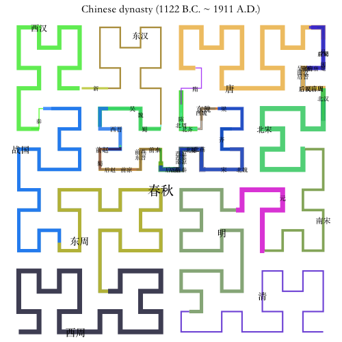

```{r, echo = FALSE, message = FALSE}
library(markdown)
options(markdown.HTML.options = c(options('markdown.HTML.options')[[1]], "toc"))

library(knitr)
knitr::opts_chunk$set(
    error = FALSE,
    tidy  = FALSE,
    message = FALSE,
    fig.align = "center",
    fig.width = 6,
    fig.height = 6)
options(markdown.HTML.stylesheet = "custom.css")

options(width = 100)

library(HilbertCurve)
```

## Introduction

[Hilbert curve](https://en.wikipedia.org/wiki/Hilbert_curve) is a type of
space-filling curves that folds one dimensional axis into a two dimensional
space, but still keeps the locality. It has advantages to visualize data with
long axis in following two aspects:

1. greatly improve resolution of the visualization fron $n$ to $\sqrt{n}$;
2. easy to visualize clusters because generally data points in the axis will
   also be close in the 2D space.

This package aims to provide an easy and flexible way to visualize data
through Hilbert curve. The implementation and example figures are based on
following sources:

- http://mkweb.bcgsc.ca/hilbert/
- http://corte.si/posts/code/hilbert/portrait/index.html
- http://bioconductor.org/packages/devel/bioc/html/HilbertVis.html

We first load the packages and set seed for random numbers.

```{r}
library(HilbertCurve)
library(circlize)
set.seed(12345)
```

Following plots show Hilbert curves with level 2, 3, 4, 5:

```{r, fig.width = 12, fig.height = 3, echo = FALSE}
grid.newpage()
pushViewport(viewport(layout = grid.layout(nr = 1, nc = 4)))
pushViewport(viewport(layout.pos.row = 1, layout.pos.col = 1))
hc = HilbertCurve(1, 16, level = 2, reference = TRUE, newpage = FALSE, title = "level = 2")
hc_segments(hc, x1 = 1, x2 = 2, gp = gpar(col = "red", lwd = 2))
upViewport()
pushViewport(viewport(layout.pos.row = 1, layout.pos.col = 2))
hc = HilbertCurve(1, 64, level = 3, reference = TRUE, newpage = FALSE, title = "level = 3")
hc_segments(hc, x1 = 1, x2 = 2, gp = gpar(col = "red", lwd = 2))
upViewport()
pushViewport(viewport(layout.pos.row = 1, layout.pos.col = 3))
hc = HilbertCurve(1, 256, level = 4, reference = TRUE, newpage = FALSE, title = "level = 4")
hc_segments(hc, x1 = 1, x2 = 2, gp = gpar(col = "red", lwd = 2))
upViewport()
pushViewport(viewport(layout.pos.row = 1, layout.pos.col = 4))
hc = HilbertCurve(1, 1024, level = 5, reference = TRUE, reference_gp = gpar(col = "grey"), 
    arrow = FALSE, newpage = FALSE, title = "level = 5")
hc_segments(hc, x1 = 1, x2 = 2, gp = gpar(col = "red", lwd = 2))
upViewport()
upViewport()
```

As shown in the above plots, as level increases, the length of the curve
becomes longer and the curve folds more densely. The number of segments (one
segment is marked in red) on the Hilbert curve is `4^level - 1`. If a Hilbert
curve with level 11 is used to map to human chromosome 1, the resolution would
be `249250621/4^11` (approximately `r round(249250621/4^11)`bp per segment).

### Locality

[Hilbert curve](https://en.wikipedia.org/wiki/Hilbert_curve) folds
one-dimensional axis into a two-dimensional space while still preserves the
locality of the data points. We visualize this attribute with a Hilbert curve
with level 5. In following animation, the point moves with its natural order
on the axis.

```{r, eval = FALSE}
for(i in 1:1024) {
    hc = HilbertCurve(1, 1024, level = 5, reference = TRUE, arrow = FALSE)
    hc_points(hc, x1 = i, np = NULL, pch = 16, size = unit(2, "mm"))
}
```

<p><video   controls loop><source src="move-on-hilbert-curve-.webm" /></video></p>

Next, we calculate the pairwise distance between data points in the 2D space
and visualize it as heatmap. The numbers on x-axis (top) and y-axis (left)
illustrate the position of data points in the original 1D axis.

```{r, fig.width = 9, fig.height = 8}
library(HilbertVis)
pos = HilbertVis::hilbertCurve(5)
mat = as.matrix(dist(pos))
library(ComplexHeatmap)

ht = Heatmap(mat, name = "dist", cluster_rows = FALSE, cluster_columns = FALSE, 
    show_row_names = FALSE, show_column_names = FALSE, 
    heatmap_legend_param = list(title = "euclidean_dist"))
draw(ht, padding = unit(c(5, 5, 5, 2), "mm"))
decorate_heatmap_body("dist", {
    grid.segments(c(0.25, 0.5, 0.75, 0, 0, 0), c(0, 0, 0, 0.25, 0.5, 0.75), 
          c(0.25, 0.5, 0.75, 1, 1, 1), c(1, 1, 1, 0.25, 0.5, 0.75), gp = gpar(lty = 2))
    grid.text(rev(c(256, 512, 768, 1024)), 0, c(0, 256, 512, 768)/1024, just = "bottom", 
        rot = 90, gp = gpar(fontsize = 10))
    grid.text(c(1, 256, 512, 768, 1024), c(1, 256, 512, 768, 1024)/1024, 1, just = "bottom",
        gp = gpar(fontsize = 10))
})
```

Basically, from the heatmap, data points which are close in the 1D axis are
still close in the 2D space (illustrated in the areas around diagonals).

Also there are some data points in (e.g, 1 ~ 256) which are close to data
points in (768 ~ 1024)(bottom left or top right area in the heatmap), but it
is only due to that the curve folds back. This exception can be easily
distinguished by adding assistant grid lines or if users are clear with the
structure of the curve.


## Basic settings

The **HilbertCurve** package provides a rather simple way to display the data
in the form of Hilbert curve. It hides all the technical parts and users only
need to think that they are adding graphics on a novel axis based on
specifying positions.

Generally, customizing a Hilbert curve follows following steps:

```{r, eval = FALSE}
hc = HilbertCurve(...)    # initialize the curve
hc_points(hc, ...)        # add points 
hc_rect(hc, ...)          # add rectangles
hc_polygon(hc, ...)       # add polygons
hc_segments(hc, ...)      # add lines
hc_text(hc, ...)          # add text
```

`HilbertCurve()` is a constructor function and initializes the Hilbert curve.
Following example means initializing a Hilbert curve with level 4 which maps
data ranging from 1 to 100. The function returns a `HilbertCurve` class
instance and it can be used to add more graphics later.

`reference` argument here is only used to show the structure of the curve.

```{r, eval = FALSE}
hc = HilbertCurve(1, 100, level = 4, reference = TRUE)
```

By default, the Hilbert curve starts from the bottom left corner. The start
position can be specifyed by `start_from` option and the orientation of the
first segment can be set by `first_seg`:

```{r, fig.width = 12, fig.height = 6, echo = FALSE}
grid.newpage()
pushViewport(viewport(layout = grid.layout(nr = 2, nc = 4)))
pushViewport(viewport(layout.pos.row = 1, layout.pos.col = 1))
hc = HilbertCurve(1, 16, level = 2, reference = TRUE, reference_gp = gpar(col = "#999999", lwd = 1), 
    newpage = FALSE, start_from = 'bottomleft', first_seg = "horizontal", 
    title = "start_from = 'bottomleft'\nfirst_seg = 'horizontal'")
upViewport()
pushViewport(viewport(layout.pos.row = 1, layout.pos.col = 2))
hc = HilbertCurve(1, 16, level = 2, reference = TRUE, reference_gp = gpar(col = "#999999", lwd = 1), 
    newpage = FALSE, start_from = 'topleft', first_seg = "horizontal", 
    title = "start_from = 'topleft'\nfirst_seg = 'horizontal'")
upViewport()
pushViewport(viewport(layout.pos.row = 1, layout.pos.col = 3))
hc = HilbertCurve(1, 16, level = 2, reference = TRUE, reference_gp = gpar(col = "#999999", lwd = 1), 
    newpage = FALSE, start_from = 'bottomright', first_seg = "horizontal",
    title = "start_from = 'bottomright'\nfirst_seg = 'horizontal'")
upViewport()
pushViewport(viewport(layout.pos.row = 1, layout.pos.col = 4))
hc = HilbertCurve(1, 16, level = 2, reference = TRUE, reference_gp = gpar(col = "#999999", lwd = 1), 
    newpage = FALSE, start_from = 'topright', first_seg = "horizontal",
    title = "start_from = 'topright'\nfirst_seg = 'horizontal'")
upViewport()

pushViewport(viewport(layout.pos.row = 2, layout.pos.col = 1))
hc = HilbertCurve(1, 16, level = 2, reference = TRUE, reference_gp = gpar(col = "#999999", lwd = 1), 
    newpage = FALSE, start_from = 'bottomleft', first_seg = "vertical", 
    title = "start_from = 'bottomleft'\nfirst_seg = 'vertical'")
upViewport()
pushViewport(viewport(layout.pos.row = 2, layout.pos.col = 2))
hc = HilbertCurve(1, 16, level = 2, reference = TRUE, reference_gp = gpar(col = "#999999", lwd = 1), 
    newpage = FALSE, start_from = 'topleft',  first_seg = "vertical",
    title = "start_from = 'topleft'\nfirst_seg = 'vertical'")
upViewport()
pushViewport(viewport(layout.pos.row = 2, layout.pos.col = 3))
hc = HilbertCurve(1, 16, level = 2, reference = TRUE, reference_gp = gpar(col = "#999999", lwd = 1), 
    newpage = FALSE, start_from = 'bottomright',  first_seg = "vertical",
    title = "start_from = 'bottomright'\nfirst_seg = 'vertical'")
upViewport()
pushViewport(viewport(layout.pos.row = 2, layout.pos.col = 4))
hc = HilbertCurve(1, 16, level = 2, reference = TRUE, reference_gp = gpar(col = "#999999", lwd = 1), 
    newpage = FALSE, start_from = 'topright',  first_seg = "vertical",
    title = "start_from = 'topright'\nfirst_seg = 'vertical'")
upViewport()

upViewport()
```

The curve can be though as a folded axis. When the coordinate for this folded
axis is initialized, low-level graphics can be added by specifying the
positions.

There are several ways to specify the "positions" of the data points. The most
common way is to construct a `IRanges` object:

```{r}
library(IRanges)
x = sort(sample(100, 20))
s = x[1:10*2 - 1]
e = x[1:10*2]
ir = IRanges(s, e)
ir
```

Here `ir` contains intervals which are composed by integers. In [later
sections](#toc_10), you will see it is also possible to specify positions with
numeric values and very large values.

### Points

There are two modes for adding points. Normally, intervals are always long in
the curve and can not be sufficiently represented by single points, thus, by
default, a list of e.g. circles compose the intervals.

```{r}
hc = HilbertCurve(1, 100, level = 4, reference = TRUE)
hc_points(hc, ir)
```

The number of circles used to represent the intervals can be controlled by
`np` (number of points per segment). `np` controls number of tiny segments
that split every Hilbert curve segment (e.g. the first horizontal segment in
the left bottom in the curve). Following plot is under `np = 3`.

```{r, fig.width = 3, fig.height = 3}
hc = HilbertCurve(1, 16, level = 2, reference = TRUE, title = "np = 3")
hc_points(hc, x1 = 1, x2 = 2, np = 3)
```

Graphic parameters can be set by `gp`. Note under this mode, the size of
points can only be controlled by `np` argument. To make it more interesting,
you can choose different shapes for the points. There are some pre-defined
shapes that you can choose from: "circle", "square", "triangle", "hexagon",
"star".

```{r}
hc = HilbertCurve(1, 100, level = 4, reference = TRUE)
hc_points(hc, ir, np = 3, gp = gpar(fill = rand_color(length(ir))),
    shape = sample(c("circle", "square", "triangle", "hexagon", "star"), length(ir), replace = TRUE))
```

In above figure, you may notice for some points, the color is more light in
the ends. This is because the segments represented by these light circles are
not fully covered by user's input intervals, thus, averaging is applied here.
E.g. if only the half of the segment represented by the circle is covered by
user's interval and the color for this circle is set to red, then after the
averaging, the color would be semi-red (`#FF8080`, an average between red and
white). Averaging is very important when you visualize the genome with
zooming. You can find more detailed explanation in the
[**Averaging**](#toc_14) section.

If `np` is set to 1 or `NULL`, there will be second mode for adding points
that the points are plotted at the center of every interval in `ir`. In this
case, `size` argument is used to control the size of the points. This mode is
useful if you have a lot of small intervals.

```{r}
hc = HilbertCurve(1, 100, level = 4, reference = TRUE)
hc_points(hc, ir, np = NULL, size = unit(runif(length(ir)), "cm"), pch = 16)
```

### Segments

Adding segments is quite straightforward. You can assign `lwd` to a large
value to simulate long and twisted rectangles.

```{r}
hc = HilbertCurve(1, 100, level = 4, reference = TRUE)
hc_segments(hc, ir, gp = gpar(lwd = 5))
```

### Rectangles

`hc_rect()` fills intervals by a list of squares. The squares always locate at
the turning points of the Hilbert curve and the width/height cannot be
modified and it is automatically adjusted according to the level of the curve.

There is a difference from `hc_points()` with setting `shape` to `square`. The
number of squares per segment is always 2 for `hc_rect()` while it can be any
number for `hc_points()`. When the interval is long enough, `hc_rect()` can
completely fill the surrounding areas.

```{r}
hc = HilbertCurve(1, 100, level = 4, reference = TRUE)
hc_rect(hc, ir, gp = gpar(fill = "#FF000080"))
```

As you can see some rectangles are not full red as well. It is also because of
averaging. See [**Averaging**](#toc_14) sections for explanation.

### Polygons

Basically polygons are quite similar to the rectangles. The major difference
is 1. borders can be set for irregular polygons; 2. there is only single color
in one polygon while for rectangles, the color can change in the ends of the
interval if the corresponding segment is not completely covered by the input
interval.

```{r}
hc = HilbertCurve(1, 100, level = 4, reference = TRUE)
hc_polygon(hc, ir, gp = gpar(fill = "red", col = "black"))
```

### Text

Text by `hc_text()` is always added at the center of each interval in `ir`.
Additional settings such as `just` and `rot` can also be set.

```{r}
hc = HilbertCurve(1, 100, level = 4, reference = TRUE)
labels = sample(letters, length(ir), replace = TRUE)
hc_text(hc, ir, labels = labels, gp = gpar(fontsize = width(ir)*2+5))
```

When the intervals are long or when there are polygons representing the
intervals, it is better to put text in the visual center of the polygons. For
this, `centered_by` argument can be set to `polygon`. Compare postions of `a`
and `b` in following plot:

```{r}
hc = HilbertCurve(1, 100, level = 4, reference = TRUE)
hc_polygon(hc, ir)
hc_text(hc, ir, labels = "a")
hc_text(hc, ir, labels = "b", centered_by = "polygon")
```

This functionality is used to [add chromosome names to the Hilbert curve](#toc_22).

### Combine low-level functions

With combination of these basic low-level graphic functions, complicated
graphics can be easily made:

```{r}
hc = HilbertCurve(1, 100, level = 4)
hc_segments(hc, IRanges(1, 100))   # This is an other way to add background line
hc_rect(hc, ir, gp = gpar(fill = rand_color(length(ir), transparency = 0.8)))
hc_polygon(hc, ir[c(1,3,5)], gp = gpar(col = "red"))
hc_points(hc, ir, np = 3, gp = gpar(fill = rand_color(length(ir))),
    shape = sample(c("circle", "square", "triangle", "hexagon", "star"), length(ir), replace = TRUE))
hc_text(hc, ir, labels = labels, gp = gpar(fontsize = width(ir)*2+5, col = "blue", font = 2))
```

## Non-integer positions

It doesn't matter if your positions are integers or not. Internally,
adjustment is automatically applied.

When positions are not integers, you can specify the positions by `x1` and
`x2`. All low-level graphical funtions accept `x1` and `x2`.

```{r}
hc = HilbertCurve(0.1, 0.8, level = 4, reference = TRUE)
hc_points(hc, x1 = c(0.15, 0.55), x2 = c(0.25, 0.65))
```

This is also useful to specify the positions with huge integers which can not
be handled by the `IRanges` class (e.g. the summation of total length of human
chromosomes).

```{r, eval = FALSE}
# code not run when generating the vignette
hc = HilbertCurve(1, 1000000000000, level = 4, reference = TRUE)
hc_points(hc, x1 = 400000000000, x2 = 600000000000)
```

Negative positions are allowed as well.

```{r, eval = FALSE}
# code not run when generating the vignette
hc = HilbertCurve(-100, 100, level = 4, reference = TRUE)
hc_points(hc, x1 = -50, x2 = 50)
```

## Pixel mode

The pixel mode can be thought as a high resolution version of `hc_rect()`.
When the level is high (e.g. > 10), the whole 2D space will be almost
completely filled by the curve and it is impossible to add or visualize e.g.
points on the curve. In this case, the 'pixel' mode visualizes each tiny
'segment' as a pixel and maps values to colors. Internally, the whole plot is
represented as an RGB matrix and every time a new layer is added to the plot,
the RGB matrix will be updated according to the color overlay. When all the
layers are added, normally a PNG figure is generated directly from the RGB
matrix. So the Hilbert curve with level 11 will generate a PNG figure with
2048x2048 resolution. This is extremely useful for visualize genomic data.
E.g. If we make a Hilbert curve for human chromosome 1 with level 11, then
each pixel can represent 60bp (``249250621/2048/2048``) which is of very high
resolution.

Under 'pixel' mode, every time a new layer is added, the image is added to the
interactive device as a rastered image.

```{r}
hc = HilbertCurve(1, 100, level = 9, mode = "pixel")
hc_layer(hc, ir)
```

Since color is graphic representation to values, there is only one graphic
setting `col`. You can add more than one layers, and just remember to set
transparent colors for the additional layers.

To map values to colors, users can try `colorRamp2()` function in **circlize**
package to generate a color mapping function. Another advantage of using
`colorRamp2()` is it can be used to generate the corresponding color legend.

```{r}
col_fun = colorRamp2(c(0, 1), c("white", "red"))
x = seq(10, 960, length = 100)
x1 = x# start of each interval
x2 = x + 2    # end of each interval
value = runif(100)  # associated values
hc = HilbertCurve(1, 1000, level = 9, mode = "pixel", title = "pixel mode")
hc_layer(hc, x1 = x1, x2 = x2, mean_mode = "absolute", col = col_fun(value))
hc_layer(hc, x1 = 750, x2 = 850, col = "#00000010")
```

Grid lines can be added to the plot for better distinguishing blocks in the
Hilbert curve. The 2D space will be split into `2^(grid_line-1)` rows and
`2^(grid_line-1)` columns.

```{r}
hc = HilbertCurve(1, 1000, level = 9, mode = "pixel", title = "pixel mode")
hc_layer(hc, x1 = x1, x2 = x2, mean_mode = "absolute", col = col_fun(value), grid_line = 3)
```

Borders can be added by setting `border` to `TRUE` or a vector of colors to
distinguish different intervals.

```{r}
hc = HilbertCurve(1, 1000, level = 9, mode = "pixel", title = "pixel mode")
hc_layer(hc, x1 = x1, x2 = x2, mean_mode = "absolute", col = col_fun(value), border = TRUE)
```

Setting `border` argument in `hc_layer` directly modifies the RGB matrix. It
adds one pixel border for each polygon and sometimes the border dispears when
compressing the image. It is more suggested to add borders by `hc_polygon()`:

```{r}
hc = HilbertCurve(1, 1000, level = 9, mode = "pixel", title = "pixel mode")
hc_layer(hc, x1 = x1, x2 = x2, mean_mode = "absolute", col = col_fun(value))
hc_polygon(hc, x1 = x1, x2 = x2)
```

For the low-level graphic functions introduced before, only `hc_polygon()` and
`hc_text()` can work for pixel mode. E.g. `hc_polygon()` draws partitions
and `hc_text()` adds labels for the partitions.

```{r}
hc = HilbertCurve(1, 1000, level = 9, mode = "pixel", title = "pixel mode")
hc_layer(hc, x1 = x1, x2 = x2, mean_mode = "absolute", col = col_fun(value))
hc_polygon(hc, x1 = c(1, 200, 500), x2 = c(200, 500, 1000))
hc_text(hc, x1 = c(1, 200, 500), x2 = c(200, 500, 1000), 
    labels = c("A", "B", "C"), gp = gpar(fontsize = 20), centered_by = "polygon")
```

The Hilbert curve can be save as a PNG figure by `hc_png()` with resolution
`2^level x 2^level`. Note only the curve itself not including the graphics by
`hc_polygon()`/`hc_text()` is exported.

```{r, eval = FALSE}
# code not run, only for demonstration
hc_png(hc, file = "test.png")
```

### Color overlay

As discussed before, under "pixel" mode, the Hilbert curve is stored in an RGB
matrix, every time a new layer is added, the RGB values that correspond to the
new input intervals will be updated according to the color and transparency of
the new layer.

By default, the color overlay for layers is applied based on the transparency
of the new layer. Under "pixel" mode, each pixel is represented by red, green
and blue colors for which the value is between 0 and 1. When a new layer with
transparency color is added, the overlayed RGB is calculated as follows (`r0`,
`g0` and `b0` correspond to the layer which is already added, `r`, `g`, `b`
and `alpha` correspond to the layer which is going to be added). The method is
implemented in `default_overlay()` function.

```{r, eval = FALSE}
r = r*alpha + r0*(1-alpha)
g = g*alpha + g0*(1-alpha)
b = b*alpha + b0*(1-alpha)
```

Insteading of globally controlling the color overlay, `hc_layer()` provides an
`overlay` argument for which users can specificly control the color overlay in
the regions that the input invervals cover. In following example, we change
the red regions which are overlapped with the blue regions to green.

```{r}
hc = HilbertCurve(1, 1000, level = 9, mode = "pixel", title = "pixel mode")
hc_layer(hc, x1 = x1, x2 = x2, mean_mode = "absolute")
hc_layer(hc, x1 = c(300, 750), x2 = c(400, 850), col = "#0000FF20",
    overlay = function(r0, g0, b0, r, g, b, alpha) { # it's only applied in [300, 400] and [750, 850]
        l = is_white(r0, g0, b0) # `is_white` simple tests whether it is the white color
        
        # change the red background to green
        if(any(!l)) {
            r0[!l] = 0 
            g0[!l] = 1 
            b0[!l] = 0 
        }

        # overlay #0000FF20 to the background
        default_overlay(r0, g0, b0, r, g, b, alpha)
    })
```

The self-defined `overlay` should accept seven arguments for which, `r0`, `g0`
and `b0` correspond to RGB channles for the layers which are already added,
`r`, `g`, `b` and `alpha` correspond to the layer which are going to be added.
The elements of i.e. `r0`, `g0`, `b0`, `r`, `g`, `b` only correspond to the
pixels that are covered by the intervals in the new layer, and `overlay`
function is applied to every interval in the new layer iteratively.

For `default_overlay()`, if any of `r0`, `g0`, `b0` has `NA`, the color from
the new layer is only used. If any of `r`, `g`, `b` has `NA`, the color from
the background is still used. The overlap of the two-layer colors are only
calculated when there are no `NA` values in the colors.

The color overlay can also be applied to continuous colors. If the color mapping is
generated by `circlize::colorRamp2()`, `circlize::col2value()` function can
transform from colors back to the original values (it can be thought as the
reversed function of `colorRamp2()`). Since the `overlay` function only provides
color information, we can use `col2value()` to obtain back the original value
and use `colorRamp2()` to generate a new set of colors.

In following plot, we change the color theme in the overlapped areas from "white-red" to
"white-blue". To do this, we first select the non-white pixels, transform
back to the original values by `col2value()` and finally change to another
color schema.

```{r}
hc = HilbertCurve(1, 1000, level = 9, mode = "pixel", title = "pixel mode")
hc_layer(hc, x1 = x1, x2 = x2, mean_mode = "absolute", col = col_fun(value))
hc_layer(hc, x1 = c(300, 750), x2 = c(400, 850), col = "#00000010",
    overlay = function(r0, g0, b0, r, g, b, alpha) {
        # non-white pixels
        l = !is_white(r0, g0, b0)

        # original value
        v = col2value(r0[l], g0[l], b0[l], col_fun = col_fun)

        # new color schema
        col_fun_new = colorRamp2(c(0, 1), c("white", "blue"))
        col_new = col_fun_new(v, return_rgb = TRUE)
        r0[l] = col_new[, 1]
        g0[l] = col_new[, 2]
        b0[l] = col_new[, 3]

        # overlay #00000010 to the background
        default_overlay(r0, g0, b0, r, g, b, alpha)
    })
```

In above example, actually you can implement such overlay by first splitting
the "red" regions into two parts by whether they overlap with the "grey"
regions. Then add the not-overlapped regions, the "grey" regions, and
overlapped regions as three independent layers.

<pre><code>hc_layer(red regions not ovelap with blue regions, use white-red color schema)
hc_layer(grey regions)
hc_layer(white-blue regions)
</code></pre>

You can see the `overlay` option provides an easier and more straightforward
way to do it.

[In later section](#toc_20), we will demonstrate using self-defined overlay
method can efficiently visualize the correspondance between H3K36me3 histone
mark and gene body.

## Add title and legends

Title can be set by the `title` argument in `HilbertCurve()`. Legend can be
passed to `legend` argument in `HilbertCurve()` as a
`grob`/`ComplexHeatmap::Legends` object or a list of these objects. Basically,
colors are the main aesthetic mappings to values, thus, `Legend()` function in
**ComplexHeatmap** package can be very helpful to create a legend. Also you
can consider `legendGrob()` in **grid** package.

```{r}
value = runif(length(ir))
col_fun = colorRamp2(c(0, 1), c("white", "red"))
legend1 = Legend(at = seq(0, 1, by = 0.2), col_fun = col_fun, title = "continuous")
legend2 = Legend(at = c("A", "B"), legend_gp = gpar(fill = c("#00FF0080", "#0000FF80")), 
    title = "discrete")

legend = list(legend1, legend2)

hc = HilbertCurve(1, 100, reference = TRUE, title = "points", legend = legend)
hc_points(hc, ir, np = 3, gp = gpar(fill = col_fun(value)))
hc_rect(hc, ir, gp = gpar(fill = sample(c("#00FF0020", "#0000FF20"), length(ir), replace = TRUE)))
```

Under "pixel" mode, and when the curve is shown on the interactive device as
raster image, title and legends can be added as well. But if the plot is
exported by `hc_png()`, there will be not title and no legend.

```{r}
col_fun = colorRamp2(c(-2, 0, 2), c("green", "white", "red"))
breaks = seq(-2, 2, by = 2)
lgd1 = Legend(at = breaks, col_fun = col_fun, title = "style 1")
lgd2 = Legend(at = rev(breaks), legend_gp = gpar(fill = col_fun(rev(breaks))), title = "style 2")
lgd3 = Legend(col_fun = col_fun, title = "style 3")

value = rnorm(length(x))
hc = HilbertCurve(1, 1000, level = 9, mode = "pixel", title = "pixel mode", 
    legend = list(lgd1, lgd2, lgd3))
hc_layer(hc, x1 = x, x2 = x+2, mean_mode = "absolute", col = col_fun(value))
```

## Averaging models

**Note: this "averaging" concept is very important. If you have unexpected
plot, try other `mean_mode` option.**

When using points or rectangles under "normal" mode, or using pixels under
"pixel" mode, each point/rectangle/pixel corresponds to a small interval. When
overlapping these intervals to the segments of Hilbert curve, and when the
segment on the curve is not fully covered by the input intervals, proper
averaging method should be applied to summarize the value in the corresponding
segments.

Depending on different scenarios, **HilbertCurve** provides three metrics for
averaging.

The overlapping model is illustrated in following plot. The red line in the
bottom represents one segment on the Hilbert curve. Black lines on the top are
the parts of input intervals that overlap with the segment. The thick lines
indicate the intersected part between the input intervals and the segment.

```{r, fig.height = 3, echo = FALSE}
library(grid)
grid.lines(c(0.1, 0.9), c(0.3, 0.3), gp = gpar(col = "red", lwd = 4))
grid.text("segment on the curve", 0.5, 0.25, just = "top", gp = gpar(col = "red"))
grid.lines(c(0, 0.2), c(0.6, 0.6))
grid.lines(c(0.3, 0.5), c(0.6, 0.6))
grid.lines(c(0.7, 1), c(0.6, 0.6))
grid.lines(c(0.1, 0.2), c(0.6, 0.6), gp = gpar(lwd = 4)); grid.text("x_1", 0.15, 0.58, just = "top")
grid.lines(c(0.3, 0.5), c(0.6, 0.6), gp = gpar(lwd = 4)); grid.text("x_2", 0.4, 0.58, just = "top")
grid.lines(c(0.7, 0.9), c(0.6, 0.6), gp = gpar(lwd = 4)); grid.text("x_3", 0.8, 0.58, just = "top")
grid.lines(c(0.1, 0.1), c(0, 1), gp = gpar(lty = 2, col = "grey"))
grid.lines(c(0.9, 0.9), c(0, 1), gp = gpar(lty = 2, col = "grey"))
grid.text("input intervals", 0.5, 0.65, just = "bottom")
```

For a segment on the curve, $n$ is the number of input intervals which overlap
with the segment (it is 3 in the above plot), $w_i$ is the width of the
intersected segments (black thick lines), $x_i$ is the value associated with
the original intervals.

The **"absolute"** method which is denoted as $v_a$ and is simple calculated as
the mean regardless of the width:

$$ v_a = \frac{\sum_i^n{x_i}}{n} $$

The **"weighted"** method which is denoted as $v_w$ is the mean weighted by
the width of intersections:

$$ v_w = \frac{\sum_i^n{x_iw_i}}{\sum_i^n{w_i}} $$

"Absolute" and "weighted" mode should be applied when background information
is not of interest. E.g. when summarizing mean methylation in a small segment,
since methylation is only related with CpG sites while not other bases,
non-CpG background should be ignored.

The **"w0"** mode is the weighted mean between the intersected parts and
un-intersected parts:

 $$ v_{w0} = \frac{v_wW + v_bW'}{W+W'} $$

for which $W$ is sum of width of the intersected parts and $W'$ is the sum of
width for the un-intersected parts. $V_b$ is the value corresponding to the
background. E.g when averaging colors which are represented as numeric RGB
values, the background value is set to 255 which corresponds to white.

There is one more value for ``mean_mode`` which is ``max_freq``. ``max_freq`` is mainly for discrete signals and in a segment,
value with the highest frequency (or with the highest length) is selected for this segment.

## Examples

This section shows several interesting examples.

Visualize rainbow colors:

```{r}
col = rainbow(100)
hc = HilbertCurve(1, 100, level = 5)
hc_points(hc, x1 = 1:99, x2 = 2:100, np = 3, gp = gpar(col = col, fill = col))
```

or use the rectangles:

```{r}
hc = HilbertCurve(1, 100, level = 5)
hc_rect(hc, x1 = 1:99, x2 = 2:100, gp = gpar(col = col, fill = col))
```

Reproduce [the visualization for IPv4 address](http://dds.ec/hilvis/iframe.html). The CIDR data is from http://www.iwik.org/ipcountry/.

```{r, fig.width = 7, fig.height = 6}
library(ComplexHeatmap)
library(RColorBrewer)

load(system.file("extdata", "cidr_list.RData", package = "HilbertCurve"))

cidr_list = cidr_list[sapply(cidr_list, length) > 0]

country = rep(names(cidr_list), times = sapply(cidr_list, length))

ip = unlist(cidr_list, "r")

# convert ip address to numbers
mat = t(as.matrix(data.frame(lapply(strsplit(ip, "\\.|/"), as.numeric))))
start = mat[, 1]*256^3 + mat[, 2]*256^2 + mat[, 3]*256 + mat[, 4]
width = sapply(mat[, 5], function(x) strtoi(paste(rep(1, 32 - x), collapse = ""), base = 2))

# top 8 countries
col = structure(rep("grey", length(cidr_list)), names = names(cidr_list))
top8_rate = sort(tapply(width, country, sum), decreasing = TRUE)[1:8]/256^4
top8 = names(top8_rate)
col[top8] = brewer.pal(8, "Set1")
top8_rate = paste0(round(top8_rate*100), "%")

# this is the part of using HilbertCurve package
lgd = Legend(at = c(top8, "Others"), labels = c(paste(top8, top8_rate), "Others"),
    legend_gp = gpar(fill = c(col[top8], "grey")), title = "Top8 contries")
hc = HilbertCurve(0, 256^4, start_from = "topleft", first_seg = "horizontal",
    mode = "pixel", level = 9, legend = lgd)
hc_layer(hc, x1 = start, x2 = start + width, col = col[country])
```

Duration of Chinese dynasties. Data from http://www.360doc.com/content/11/1123/02/7829717_166641336.shtml.

```{r, eval = FALSE, echo = -c(20, 30)}
load(system.file("extdata", "chinese_dynasty.RData", package = "HilbertCurve"))

detect_os = function() {
    if (grepl('w|W', .Platform$OS.type)) {
        os = "Windows"
    } else {
        if (grepl('darwin', version$os)) {
            os = "MacOS"
        } else {
            os = "Linux"
        }
    }
    return(os)
}
# default font family for Chinese under different OS
fontfamily = switch(detect_os(),
    Windows = "SimSun",
    MacOS = "Songti SC",
    Linux = "Songti SC")

png("chinese_dynasty.png", width = 500, height = 500)
hc = HilbertCurve(min(chinese_dynasty[[2]]), max(chinese_dynasty[[3]]), 
    title = "Chinese dynasty (1122 B.C. ~ 1911 A.D.)", 
    title_gp = gpar(fontsize = 16, fontfamily = fontfamily))
hc_segments(hc, x1 = chinese_dynasty[[2]], x2 = chinese_dynasty[[3]], 
    gp = gpar(col = rand_color(nrow(chinese_dynasty), transparency = 0.2), 
        lwd = runif(nrow(chinese_dynasty), min = 1, max = 10)))
hc_text(hc, x1 = chinese_dynasty[[2]], x2 = chinese_dynasty[[3]], labels = chinese_dynasty[[1]], 
    gp = gpar(fontsize = (chinese_dynasty[[3]] - chinese_dynasty[[2]])/500 * 10 + 8, 
        fontfamily = fontfamily))

year = seq(-1000, 2000, by = 100)
hc_text(hc, x1 = year, labels = ifelse(year < 0, paste0(-year, "BC"), year), 
    gp = gpar(fontsize = 8))
invisible(dev.off())
```

```{r, echo = FALSE, results = "asis"}
cat("<p><center></center></p>\n")
```

## GenomicHilbertCurve: specific for genomic data

To make it easy with genomic data which is always stored as a data frame or a
`GRanges` object, the package provides specific class and functions to deal
with. `GenomicHilbertCurve()` initializes the Hilbert curve by specifying
chromosomes or specific background regions. After that, the data frame or
`GRanges` object which contains genomic intervals can be mapped to the curve.


```{r, eval = FALSE}
hc = GenomicHilbertCurve(chr, species, ...)
hc = GenomicHilbertCurve(background, ...)
```

Following functions are depatched to the `GenomicHilbertCurve` class, and the
second argument should be a data frame (which is in bed-format) or a `GRanges`
object.

```{r, eval = FALSE}
hc_points(hc, gr, ...)
hc_rect(hc, gr, ...)
hc_polygon(hc, gr, ...)
hc_segments(hc, gr, ...)
hc_text(hc, gr, ...)
hc_layer(hc, gr, ...)
```

Following illustrates several examples of making genome-level Hilbert curves.

### Genes

The first example visualizes genes on chromosome 1 ([RefSeq genes for human, hg19](https://genome.ucsc.edu/cgi-bin/hgTables?hgsid=451688581_FoCuggvGvavyfGhdj9sSGrGlnErE&clade=mammal&org=Human&db=hg38&hgta_group=genes&hgta_track=refGene&hgta_table=0&hgta_regionType=genome&position=chr9%3A133252000-133280861&hgta_outputType=primaryTable&hgta_outFileName=)). Here random colors are used
to distinguish different genes.

```{r}
library(GenomicRanges)
load(system.file("extdata", "refseq_chr1.RData", package = "HilbertCurve"))
hc = GenomicHilbertCurve(chr = "chr1", level = 5, reference = TRUE, 
    reference_gp = gpar(lty = 1, col = "grey"), arrow = FALSE)
hc_segments(hc, g, gp = gpar(lwd = 6, col = rand_color(length(g))))
```

### Sequence conservation

The conserved regions on human chromosome 1 between mouse and human or between zebrafish and human are downloaded from [UCSC
Table Browser](http://genome.ucsc.edu/cgi-bin/hgTables?hgsid=472144813_MQ4BbmgW37du53Nw6n9SKKy6mb6r&clade=mammal&org=Human&db=hg38&hgta_group=compGeno&hgta_track=placentalChainNet&hgta_table=netMm10&hgta_regionType=genome&position=chr9%3A133252000-133280861&hgta_outputType=primaryTable&hgta_outFileName=). The parameters for downloading are:

<pre><code>clade: Mammal
genome: Human
assembly: Feb. 2009(GRCh37/hg19)
group: Comparative Genomics
= for mouse
track: Placental Chain/Net
table: Mouse Net (netMm10)
= for zebrafish
track: Vertebrate Chain/Net
table: Zebrafish Net(netDanRer7)
</code></pre>

The "net" alignment which is used here shows the best alignment (the alignment algorithm allows longer gaps than traditional affine gap scoring systems) between each part in human genome and other genomes. For a detailed description
of the alignment strategy, please go to [UCSC
Table Browser](http://genome.ucsc.edu/cgi-bin/hgTables?hgsid=472144813_MQ4BbmgW37du53Nw6n9SKKy6mb6r&clade=mammal&org=Human&db=hg38&hgta_group=compGeno&hgta_track=placentalChainNet&hgta_table=netMm10&hgta_regionType=genome&position=chr9%3A133252000-133280861&hgta_outputType=primaryTable&hgta_outFileName=), and click **describe table schema** button.

In following example, the conservation data is mapped to a level 6 Hilbert curve under "normal" mode.
Points are used as the graphic and each segment on the Hilbert curve is split by 3 points. In this case,
each point on the curve represents approximately 30kb. Only chromosome 1 is visualized.

The point is fully red if the window which is represented by this point is completely covered by the conserved regions,
and it is yellow if it is not covered by any region. Colors are interpolated linearly between red and yellow
if it is partially covered by the conserved regions.

```{r}
# for generating the legend
lgd = Legend(col_fun = colorRamp2(c(0, 1), c("yellow", "red")), 
    title = "Conservation",
    at = c(0, 0.2, 0.4, 0.6, 0.8, 1), 
    labels = c("0%", "20%", "40%", "60%", "80%", "100%"))
chr1_len = 249250621
```

Conservation between human and mouse.

```{r, fig.width = 7.5, fig.height = 7}
load(system.file("extdata", "mouse_net.RData", package = "HilbertCurve"))
seqlengths(mouse) = chr1_len # it is only used to extract the complement
nonmouse = gaps(mouse); nonmouse = nonmouse[strand(nonmouse) == "*"]
gr = c(mouse, nonmouse)
col = c(rep("red", length(mouse)), rep("yellow", length(nonmouse)))
hc = GenomicHilbertCurve(chr = "chr1", level = 6, 
    title = "Conservation between mouse and human on chr1",
    legend = lgd)
hc_points(hc, gr, np = 3, gp = gpar(col = NA, fill = col))
```

Conservation between human and zebrafish.

```{r, fig.width = 7.5, fig.height = 7}
load(system.file("extdata", "zebrafish_net.RData", package = "HilbertCurve"))
seqlengths(zebrafish) = chr1_len
nonzebrafish = gaps(zebrafish); nonzebrafish = nonzebrafish[strand(nonzebrafish) == "*"]
gr = c(zebrafish, nonzebrafish)
col = c(rep("red", length(zebrafish)), rep("yellow", length(nonzebrafish)))
hc = GenomicHilbertCurve(chr = "chr1", level = 6, 
    title = "Conservation between zebrafish and human on chr1",
    legend = lgd)
hc_points(hc, gr, np = 3, gp = gpar(col = NA, fill = col))
```

Compareing these two plots, we have following conclusions:

1. Although it is already known that mouse is far more orthologically close to
   human, the Hilber curve illustrates more clearly that almost all parts of
   human chromosome 1 have similar sequences on mouse genome.
2. The start and end of the human chromosome 1 is less conserved to mouse
   compared to other parts in the chromosome. Also there are several less
   conserved regions inside the human chromosome.
3. It illustrates how the regions which are conserved to zebrafish spread in
   the human chromosome and it gives an estimation of the positions and length
   of the conserved regions.

The idea of visualizing sequencing conservation through the Hilbert curve is
from [here](http://mkweb.bcgsc.ca/hilbert/scientificamerican.mhtml).

### GC percent

Following figure visualizes GC percent on chromosome 1, under "normal" mode.
The GC content per 1KB window is calculated by `hgGcPercent.bin` binary which
is downloaded from http://hgdownload.soe.ucsc.edu/admin/exe/linux.x86_64/. To 
speed up, we only used chromosome 1 for demonstration.

```{r, eval = grepl("odcf", Sys.info()["nodename"]) & FALSE, echo = 2:10}
png('gc_percent_chr1_points.png', width = 500, height = 500)
df = read.table(pipe("awk '$1==\"chr1\"' ~/HilbertCurveTest/hg19_gc_percent_window1000.bed"))
col_fun = colorRamp2(quantile(df[[5]], c(0.1, 0.5, 0.9)), c("green", "#FFFFCC", "red"))
lgd = Legend(col_fun = col_fun, title = "GC percent",
    at = c(300, 400, 500, 600), 
    labels = c("30%", "40%", "50%", "60%"))

hc = GenomicHilbertCurve(chr = "chr1", level = 6, legend = lgd)
hc_points(hc, df, np = 3, gp = gpar(fill = col_fun(df[[5]]), col = col_fun(df[[5]])))
hc_rect(hc, reduce(g), gp = gpar(fill = "#00000020", col = NA))
invisible(dev.off())
```

```{r, echo = FALSE, results = "asis"}
cat("<p><center></center></p>\n")
```

Or visualize GC percent on chromosome 1, under "pixel" mode (you may see the difference
between "normal" mode and "pixel" mode here):

```{r, eval = grepl("odcf", Sys.info()["nodename"]) & FALSE, fig.keep = "none", echo = 2:4}
png("gc_percent_chr1.png", width = 500, height = 500)
hc = GenomicHilbertCurve(chr = "chr1", level = 9, mode = "pixel", legend = lgd)
hc_layer(hc, df, col = col_fun(df[[5]]))
hc_layer(hc, reduce(g), col = "#00000020")
invisible(dev.off())
```

```{r, echo = FALSE, results = "asis"}
cat("<p><center></center></p>\n")
```

Background is not necessary to be the whole chromosome, it can also be self-defined regions.
The background can be specified as a `GRanges` object and pass to `background` argument. 
In following example, only the first half part of chromosome 1 is used to initialize the curve.

**Note: when using `background`, one chromosome can only exist in one row in `background`.**

```{r, eval = grepl("odcf", Sys.info()["nodename"]) & FALSE, fig.keep = "none", echo = 2:6}
png("gc_percent_half_chr1.png", width = 500, height = 500)
background = GRanges(seqnames = "chr1", ranges = IRanges(1, ceiling(chr1_len/2)))
hc = GenomicHilbertCurve(background = background, level = 9, mode = "pixel", legend = lgd,
    title = "First half of chromosome 1")
hc_layer(hc, df, col = col_fun(df[[5]]))
hc_layer(hc, reduce(g), col = "#00000020")
invisible(dev.off())
```

```{r, echo = FALSE, results = "asis"}
cat("<p><center></center></p>\n")
```

### Histone modifications

Different modifications (e.g. methylation, acetylation) of the histones affect
the chromatin-DNA interaction, thus play roles in transcription regulation.
Different types of modifications relates to different types of gene
regulation. E.g. H3H4me3 modification is found in actively transcribed
promoters. ChIP-sequencing (ChIPSeq) utilizes highthroughput DNA sequencing
technology to identify status of chromatin states genome-wide, thus it
provides a way to study gene regulation in a global aspect.

In this section, we visualize four types of histone modifications (H3K27ac,
H3K36me3, H3K4me3, H3K9me3). The ChIPSeq data are downloaded from Roadmap
(http://genboree.org/EdaccData/Release-9/sample-experiment/Lung/, The bed
files are alignments of reads, you need to convert to the basepair or
window-based coverage before using following R commands). Following files for
four histone modifications are used to visualize:

<pre><code>
UCSD.Lung.H3K27ac.STL002.bed
UCSD.Lung.H3K36me3.STL002.bed
UCSD.Lung.H3K4me3.STL002.bed
UCSD.Lung.H3K9me3.STL002.bed
</code></pre>

Since we are going to plot more than one histome marks, the code for plotting are wrapped as a simple function:

```{r}
library(GetoptLong)
plot_histone_mark = function(mark) {
    df = read.table(pipe(qq("awk '$5>0 && $1==\"chr1\"' ~/HilbertCurveTest/UCSD.Lung.@{mark}.STL002.bed")), 
        sep = "\t")
    col_fun = colorRamp2(c(0, quantile(df[[5]], 0.99)), c("white", "red"))
    lgd1 = Legend(col_fun = col_fun, title = "Intensity")
    lgd2 = Legend(labels = c(mark, "gene"), legend_gp = gpar(fill = c("#FF0000", "#CCCCCC")),
        title = "Layer")

    hc = GenomicHilbertCurve(chr = "chr1", level = 9, mode = "pixel", 
        title = qq("Intensity of @{mark} mark on chr1"), legend = list(lgd1, lgd2))
    hc_layer(hc, df, col = col_fun(df[[5]]))
    hc_layer(hc, reduce(g), col = "#00000010")
}
```

In above code, intensities of histone modifications are mapped to a level 9
Hilbert curve so that each pixel approximately represents a window of 950bp.
In each plot, there is an additional grey layer which represents the regions
of genes (RefSeq genes) (`g` is from `system.file("extdata", "refseq_chr1.RData", package = "HilbertCurve")`). 

H3K27ac is a mark for active enhancers which is narrow and sharp. The Hilbert
curve shows this attributes and also shows enhancers may exist in form of
clusters.

```{r, eval = grepl("odcf", Sys.info()["nodename"]) & FALSE, fig.keep = "none", echo = 2}
png("H3K27ac_chr1.png", width = 500, height = 500)
plot_histone_mark("H3K27ac")
invisible(dev.off())
```

```{r, echo = FALSE, results = "asis"}
cat("<p><center></center></p>\n")
```

H3K36me3 is a mark for actively transcribed gene bodies. The Hilbert curve
shows that basically most of H3K36me3 modification with high intensity exists
as big blocks.

```{r, eval = grepl("odcf", Sys.info()["nodename"]) & FALSE, fig.keep = "none", echo = 2}
png("H3K36me3_chr1.png", width = 500, height = 500)
plot_histone_mark("H3K36me3")
invisible(dev.off())
```

```{r, echo = FALSE, results = "asis"}
cat("<p><center></center></p>\n")
```

H3K4me3 is a mark for TSS of actively transcribed genes which is also narrow
and sharp. The Hilbert curve confirms this and also shows the size of marks
are quite consistent.

```{r, eval = grepl("odcf", Sys.info()["nodename"]) & FALSE, fig.keep = "none", echo = 2}
png("H3K4me3_chr1.png", width = 500, height = 500)
plot_histone_mark("H3K4me3")
invisible(dev.off())
```

```{r, echo = FALSE, results = "asis"}
cat("<p><center></center></p>\n")
```

H3K9me3 is a mark for repressed genes. The Hilbert curve shows that H3K9me3
modications spread over huge regions in the chromosome.

```{r, eval = grepl("odcf", Sys.info()["nodename"]) & FALSE, fig.keep = "none", echo = 2}
png("H3K9me3_chr1.png", width = 500, height = 500)
plot_histone_mark("H3K9me3")
invisible(dev.off())
```

```{r, echo = FALSE, results = "asis"}
cat("<p><center></center></p>\n")
```

When there are more than one layers added and users want to see the
correspondance between different genomic features, they can define a color
overlay function to enhance the visual effects of the overlapping areas. In
following example, when regions for H3K36me3 mark are overlapped with gene
bodies, the color theme is changed to white-purple.

```{r, eval = grepl("odcf", Sys.info()["nodename"]) & FALSE, fig.keep = "none", echo = c(1:9, 11:25)}
df = read.table(pipe("awk '$5>0 && $1==\"chr1\"' ~/HilbertCurveTest/UCSD.Lung.H3K36me3.STL002.bed"), 
    sep = "\t")
col_fun = colorRamp2(c(0, quantile(df[[5]], 0.99)), c("white", "red"))
col_fun_new = colorRamp2(c(0, quantile(df[[5]], 0.99)), c("white", "purple"))
lgd1 = Legend(col_fun = col_fun, title = "Intensity")
lgd2 = Legend(labels = c("H3K36me3", "overlap", "gene"),
    legend_gp = gpar(fill = c("#FF0000", "purple", "#CCCCCC")), title = "Layer")

png("H3K36me3_chr1_overlap.png", width = 500, height = 500)
hc = GenomicHilbertCurve(chr = "chr1", level = 9, mode = "pixel",
    title = "Intensity of H3K36me3 mark on chr1", legend = list(lgd1, lgd2))
hc_layer(hc, df, col = col_fun(df[[5]]))
hc_layer(hc, reduce(g), col = "#00000010",
    overlay = function(r0, g0, b0, r, g, b, alpha) {
        l = !is_white(r0, g0, b0)
        v = col2value(r0[l], g0[l], b0[l], col_fun = col_fun)

        col_new = col_fun_new(v, return_rgb = TRUE)
        r0[l] = col_new[, 1]
        g0[l] = col_new[, 2]
        b0[l] = col_new[, 3]

        default_overlay(r0, g0, b0, r, g, b, alpha)
    })
invisible(dev.off())
```

```{r, echo = FALSE, results = "asis"}
cat("<p><center></center></p>\n")
```

### Methylation

Next figure visualizs methylation on human chromosome 1. Blue corresponds to
un-methylation and red corresponds to full-methylation. One thing which is
very important here is that methylation is always measured at single CpG
sites, so the mode for averaging should be set to `absolute` in order to
sumarize mean methylation values only on CpG sites. Data are from
http://genboree.org/EdaccData/Release-9/sample-experiment/Lung/.

The methylation plot shows quite clear patterns for un-methylated regions
which are small and sharp, fully methylated regions and intermediate
methylated regions which are represented as large blocks.

```{r, eval = grepl("odcf", Sys.info()["nodename"]) & FALSE, fig.keep = "none", echo = c(1:4, 6:7)}
df = read.table(pipe("awk '$1==\"chr1\"' ~/HilbertCurveTest/UCSD.Lung.Bisulfite-Seq.STL002.bed"), 
    sep = "\t")
col_fun = colorRamp2(c(0, 0.5, 1), c("blue", "white", "red"))
lgd = Legend(col_fun = col_fun, title = "Methylation")
png("methylation_chr1.png", width = 500, height = 500)
hc = GenomicHilbertCurve(chr = "chr1", level = 9, mode = "pixel", legend = lgd)
hc_layer(hc, df, col = col_fun(df[[5]]), mean_mode = "absolute")
invisible(dev.off())
```

```{r, echo = FALSE, results = "asis"}
cat("<p><center></center></p>\n")
```

### Put multiple chromosomes in one curve

We demonstrated how to visualize one single chromosome through Hilbert curve,
but sometimes we also want to put all chromosomes into one plot to get a full
view of the genome. One solution is to construct a 'huge fake' chromosome
which merges all real chromosomes. `GenomicHilbertCurve()` makes it easy. You
can specify multiple chromosomes by sending a vector to `chr` argument or
specify more than one background intervals in `background` argument.

In following examples, copy number loss and gain for 22 human chromosomes are
visualized. Also color for the overlapping regions between layer for gain
events and layer for loss events is changed to purple by defining `overlay`
function. Data is from [Database of Genomic Variants, CNV
map](http://dgv.tcag.ca/dgv/app/downloads).


```{r, eval = grepl("odcf", Sys.info()["nodename"]) & FALSE, fig.keep = "none", echo = -c(1, 16)}
png("cnv_all_chromosomes.png", width = 500, height = 500)
hc = GenomicHilbertCurve(chr = paste0("chr", 1:22), level = 9, mode = "pixel")
df_gain = read.table("~/HilbertCurveTest/Stringent.Gain.hg19.2015-02-03.txt", 
    header = TRUE, stringsAsFactors = FALSE)
hc_layer(hc, df_gain, col = "red")
df_loss = read.table("~/HilbertCurveTest/Stringent.Loss.hg19.2015-02-03.txt", 
    header = TRUE, stringsAsFactors = FALSE)
hc_layer(hc, df_loss, col = "green", grid_line = 3, grid_line_col = "grey",
    overlay = function(r0, g0, b0, r, g, b, alpha) {
        l = !is_white(r0, g0, b0)
        r[l] = 160/255
        g[l] = 32/255
        b[l] = 240/255
        list(r, g, b)
})
invisible(dev.off())
```

```{r, echo = FALSE, results = "asis"}
cat("<p><center></center></p>\n")
```

A map which shows the chromosome positions in Hilbert curve is very necessary
for knowing which part in the curve represents which chromosome.

```{r, eval = grepl("odcf", Sys.info()["nodename"]) & FALSE, echo = 2, fig.keep = "none"}
png('map_all_chromosomes.png', width = 500, height = 500)
hc_map(hc)
invisible(dev.off())
```

```{r, echo = FALSE, results = "asis"}
cat("<p><center></center></p>\n")
```

The map can be overlayed to the Hilbert curve for easy correspondance.

```{r, eval = grepl("odcf", Sys.info()["nodename"]) & FALSE, fig.keep = "none", echo = -c(1, 13)}
png('cnv_all_chromosomes_overlay.png', width = 500, height = 500)
hc = GenomicHilbertCurve(chr = paste0("chr", 1:22), level = 9, mode = "pixel")
hc_layer(hc, df_gain, col = "red")
hc_layer(hc, df_loss, col = "green", 
    overlay = function(r0, g0, b0, r, g, b, alpha) {
        l = !is_white(r0, g0, b0)
        r[l] = 160/255
        g[l] = 32/255
        b[l] = 240/255
        list(r, g, b)
})
hc_map(hc, add = TRUE, fill = rand_color(22, transparency = 0.8))
invisible(dev.off())
```

```{r, echo = FALSE, results = "asis"}
cat("<p><center></center></p>\n")
```

If colors of chromosomes defuse the colors in the original Hilbert curve, you
can only draw borders of chromosomes.

```{r, eval = grepl("odcf", Sys.info()["nodename"]) & FALSE, fig.keep = "none", echo = -c(1, 13)}
png('cnv_all_chromosomes_border.png', width = 500, height = 500)
hc = GenomicHilbertCurve(chr = paste0("chr", 1:22), level = 9, mode = "pixel")
hc_layer(hc, df_gain, col = "red")
hc_layer(hc, df_loss, col = "green",
    overlay = function(r0, g0, b0, r, g, b, alpha) {
        l = !is_white(r0, g0, b0)
        r[l] = 160/255
        g[l] = 32/255
        b[l] = 240/255
        list(r, g, b)
})
hc_map(hc, add = TRUE, fill = NA, border = "grey")
invisible(dev.off())
```

```{r, echo = FALSE, results = "asis"}
cat("<p><center></center></p>\n")
```

If you want to compare several plots simutaneously, you can use
`grid.layout()` to put them together. Remember to set `newpage` to `FALSE` in
`HilbertCurve()` or `GenomicHilbertCurve()`. Also note we set `labels` in `hc_map()`
to define the labels added to each chromosome.

```{r, eval = grepl("odcf", Sys.info()["nodename"]) & FALSE, fig.keep = "none", echo = 2:32}
png('cnv_compare.png', width = 900, height = 300)
plot_curve = function(column, ...) {
    cm = ColorMapping(levels = c("gain", "loss", "both"), color = c("red", "green", "purple"))
    hc = GenomicHilbertCurve(chr = paste0("chr", 1:22), level = 9, mode = "pixel",
        title = qq("CNV for @{column}"), ...)  ## `qq()` is from the GetoptLong package

    df = read.table("~/HilbertCurveTest/Stringent.Gain.hg19.2015-02-03.txt", header = TRUE,
        stringsAsFactors = FALSE)
    df = df[df[[column]] > 0, , drop = FALSE]
    hc_layer(hc, df, col = "red")

    df = read.table("~/HilbertCurveTest/Stringent.Loss.hg19.2015-02-03.txt", header = TRUE, 
        stringsAsFactors = FALSE)
    df = df[df[[column]] > 0, , drop = FALSE]
    hc_layer(hc, df, col = "green", 
        overlay = function(r0, g0, b0, r, g, b, alpha) {
            l = !is_white(r0, g0, b0)
            r[l] = 160/255
            g[l] = 32/255
            b[l] = 240/255
            list(r, g, b)
    })
    hc_map(hc, labels = 1:22, add = TRUE, fill = NA, border = "grey")
}

pn = c("African", "Asian", "European")
pushViewport(viewport(layout = grid.layout(nrow = 1, ncol = 3)))
for(i in seq_along(pn)) {
    pushViewport(viewport(layout.pos.row = 1, layout.pos.col = i))
    plot_curve(pn[i], newpage = FALSE)
    upViewport()
}
upViewport()

invisible(dev.off())
```

```{r, echo = FALSE, results = "asis"}
cat("<p><center></center></p>\n")
```

## Session info

```{r}
sessionInfo()
```
