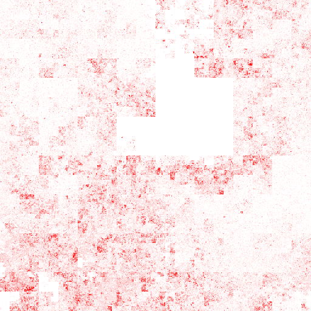

<!--
%\VignetteEngine{knitr}
%\VignetteIndexEntry{Make Hilbert Curve}
-->

Make Hilbert Curve
========================================

**Author**: Zuguang Gu ( z.gu@dkfz.de )

**Date**: `r Sys.Date()`

-------------------------------------------------------------

```{r, echo = FALSE, message = FALSE}
library(knitr)
knitr::opts_chunk$set(
    error = FALSE,
    tidy  = FALSE,
    message = FALSE,
    fig.align = "center",
    fig.width = 6,
    fig.height = 6)
options(markdown.HTML.stylesheet = "custom.css")

options(width = 100)
```

[Hilbert curve](https://en.wikipedia.org/wiki/Hilbert_curve) is a type of space-filling curves
that fold one dimensional axis into a two dimensional space, but with still keep the locality.
So It has advantages to visualize data with long axis in following two aspects:

1. greatly improve resolution for the visualization
2. easy to visualization clusters because generally they will also be close in the Hilbert curve. 

This package aims to provide a easy and flexible way to visualize data through Hilbert curve.
The implementation and example figures are based on following sources:

- http://mkweb.bcgsc.ca/hilbert/
- http://corte.si/posts/code/hilbert/portrait/index.html
- http://bioconductor.org/packages/devel/bioc/html/HilbertVis.html

```{r}
suppressPackageStartupMessages(library(HilbertCurve))
library(HilbertVis)
library(circlize)
set.seed(123)
```

Following shows Hilbert curve with level 2, 3, 4, 5:

```{r, fig.width = 12, fig.height = 3, echo = FALSE}
grid.newpage()
pushViewport(viewport(layout = grid.layout(nr = 1, nc = 4)))
pushViewport(viewport(layout.pos.row = 1, layout.pos.col = 1))
HilbertCurve(1, 100, level = 2, reference = TRUE, newpage = FALSE)
grid.text("level = 2", gp = gpar(col = "red", fontsize = 16))
upViewport()
pushViewport(viewport(layout.pos.row = 1, layout.pos.col = 2))
HilbertCurve(1, 100, level = 3, reference = TRUE, newpage = FALSE)
grid.text("level = 3", gp = gpar(col = "red", fontsize = 16))
upViewport()
pushViewport(viewport(layout.pos.row = 1, layout.pos.col = 3))
HilbertCurve(1, 100, level = 4, reference = TRUE, newpage = FALSE)
grid.text("level = 4", gp = gpar(col = "red", fontsize = 16))
upViewport()
pushViewport(viewport(layout.pos.row = 1, layout.pos.col = 4))
HilbertCurve(1, 100, level = 5, reference = TRUE, arrow = FALSE, newpage = FALSE)
grid.text("level = 5", gp = gpar(col = "red", fontsize = 16))
upViewport()
upViewport()
```

Following heatmap shows distance between elements in the Hilbert curve.
Basically, if elements are close in the one dimensional axis, they also have small 
distance in the Hilbert curve (regions around diag0nals)

```{r, fig.width = 7, echo = FALSE}
pos = HilbertVis::hilbertCurve(5)
mat = as.matrix(dist(pos))
library(ComplexHeatmap)

Heatmap(mat, name = "euclidean_dist", cluster_rows = FALSE, cluster_columns = FALSE,
	show_row_names = FALSE, show_column_names = FALSE)
seekViewport("euclidean_dist_heatmap_body_1")
grid.segments(c(0.25, 0.5, 0.75, 0, 0, 0), c(0, 0, 0, 0.25, 0.5, 0.75), 
	c(0.25, 0.5, 0.75, 1, 1, 1), c(1, 1, 1, 0.25, 0.5, 0.75), gp = gpar(lty = 2))
```

## Graphic settings

`HilbertCurve()` is a constructor function and initializes the Hilbert curve. The start
and end of the position are specified as well as the level of the Hilbert curve. The function
returns a `HilbertCurve` class instance and it can be used to add more graphics later.

When add graphics, the range of positions should be specified as a `IRanges` object.

In following example, we add points for the regions. By default, a list of points are plotted
if the region is long.

```{r}
hc = HilbertCurve(1, 100, level = 4, reference = TRUE)
hc

x = sort(sample(100, 20))
s = x[1:10*2 - 1]
e = x[1:10*2]
ir = IRanges(s, e)

hc_points(hc, ir)
```

The number of 'points' in a segment can be controlled by `np` and graphical parameters 
can be set by `gp`. Note under this mode, the size of points can only be changed by `np` argument.

```{r}
hc = HilbertCurve(1, 100, level = 4, reference = TRUE)
hc_points(hc, ir, , np = 3, gp = gpar(fill = rand_color(length(ir))))
```

Add segments:

```{r}
hc = HilbertCurve(1, 100, level = 4, reference = TRUE)
hc_segments(hc, ir)
```

Add rectangles:

```{r}
hc = HilbertCurve(1, 100, level = 4, reference = TRUE)
hc_rect(hc, ir)
```

Add texts:

```{r}
hc = HilbertCurve(1, 100, level = 4, reference = TRUE)
labels = sample(letters, length(ir), replace = TRUE)
hc_text(hc, ir, labels)
```

With combination of these basic graphic functions, complicated graphics can be easily made:

```{r}
hc = HilbertCurve(1, 100, level = 4)
hc_segments(hc, IRanges(1, 100))
hc_rect(hc, ir)
hc_points(hc, ir, np = 3)
hc_text(hc, ir, labels, gp = gpar(fontsize = 16, col = "blue"))
```

## Pixel mode

When the level of the Hilbert curve is high (e.g. 10), it is not a good idea to plot it in
the normal way. Under the 'pixel' mode, .. will be mapped to one pixel and a PNG will be outputed
with resolution of 2^n x 2^n.

You can add more than one layers, just remember to set transparent colors.

```{r, echo = FALSE}
knit_hooks$set(custom_plot = hook_plot_custom)
```

```{r, custom_plot = TRUE, fig.ext = 'png'}
hc = HilbertCurve(1, 100, level = 9, mode = "pixel")
hc_layer(hc, ir)
hc_save(hc, file = fig_path('.png'))
```

## Examples

Visualize rainbow colors:

```{r}
col = rainbow(100)
hc = HilbertCurve(1, 100, level = 5)
ir = IRanges(start = 1:99, end = 2:100)
hc_points(hc, ir, np = 4, gp = gpar(col = col, fill = col))
```

Genes on chromosome 1 (RefSeq genes for human). Here random colors are used
to represent to different genes.

```{r}
chr1_len = 249250621
library(GenomicRanges)
load(paste0(system.file("extdata", package = "HilbertCurve"), "/refseq_chr1.RData"))
hc = HilbertCurve(1, chr1_len, level = 5)
hc_segments(hc, IRanges(start = 1, end = chr1_len), gp = gpar(col = "grey"))
hc_segments(hc, ranges(g), gp = gpar(lwd = unit(6, "mm"), col = rand_color(length(g))))
```

Following two figures compare sequence conservations.

```{r}
load(paste0(system.file("extdata", package = "HilbertCurve"), "/mouse_net.RData"))
hc = HilbertCurve(1, chr1_len, level = 6)
ir1 = ranges(mouse)
ir2 = setdiff(IRanges(1, chr1_len), ir1)
ir = c(ir1, ir2)
col = c(rep("red", length(ir1)), rep("yellow", length(ir2)))
hc_points(hc, ir, np = 3, gp = gpar(col = col, fill = col))

load(paste0(system.file("extdata", package = "HilbertCurve"), "/zebrafish_net.RData"))
hc = HilbertCurve(1, chr1_len, level = 6)
ir1 = ranges(zebrafish)
ir2 = setdiff(IRanges(1, chr1_len), ir1)
ir = c(ir1, ir2)
col = c(rep("red", length(ir1)), rep("yellow", length(ir2)))
hc_points(hc, ir, np = 3, gp = gpar(col = col, fill = col))
```





```{r, echo = FALSE, eval = FALSE}
library(GetoptLong)

df = read.table("/icgc/dkfzlsdf/analysis/B080/guz/gc_percent/hg19_gc_percent_window1000.bed")
df = df[df[[1]] == "chr1", ]
col_fun = colorRamp2(c(0, 500, 1000), c("green", "#FFFFCC", "red"))
png("gc_percent_chr1_points.png", width = 500, height = 500)
hc = HilbertCurve(1, chr1_len, level = 6)
hc_points(hc, IRanges(df[[2]], df[[3]]), np = 3, gp = gpar(fill = col_fun(df[[5]]), col = col_fun(df[[5]])))
hc_rect(hc, reduce(ranges(g)), gp = gpar(fill = "#00000020", col = "#00000020"))
dev.off()

hc = HilbertCurve(1, chr1_len, level = 9, mode = "pixel")
hc_layer(hc, IRanges(df[[2]], df[[3]]), col = col_fun(df[[5]]))
hc_layer(hc, reduce(ranges(g)), col = "#00000020")
hc_save(hc, file = "gc_percent_chr1.png")

for(mark in c("H3K27ac", "H3K36me3", "H3K4me1", "H3K4me3", "H3K9me3")) {
	df = read.table(pipe(qq("awk '$5>0 && $1==\"chr1\"' /icgc/dkfzlsdf/analysis/B080/guz/HilbertCurveTest/UCSD.Lung.@{mark}.STL002.bed")), sep = "\t")
	df = df[df[[1]] == "chr1", ]
	col_fun = colorRamp2(c(0, quantile(df[[5]], 0.99)), c("white", "red"))
	hc = HilbertCurve(1, chr1_len, level = 9, mode = "pixel")
	hc_layer(hc, IRanges(df[[2]], df[[3]]), col = col_fun(df[[5]]))
	hc_save(hc, file = qq("@{mark}_chr1.png"))
}

df = read.table(pipe("awk '$1==\"chr1\"' /icgc/dkfzlsdf/analysis/B080/guz/HilbertCurveTest/UCSD.Lung.Bisulfite-Seq.STL002.bed"), sep = "\t")
df = df[df[[1]] == "chr1", ]
col_fun = colorRamp2(c(0, 0.5, 1), c("blue", "white", "red"))
hc = HilbertCurve(1, chr1_len, level = 9, mode = "pixel")
hc_layer(hc, IRanges(df[[2]], df[[3]]), col = col_fun(df[[5]]), mean_mode = "absolute")
hc_save(hc, file = "methylation_chr1.png")
```

## Session info

```{r}
sessionInfo()
```
