```{r, echo = FALSE, message = FALSE}
library(markdown)
options(markdown.HTML.options = c(options('markdown.HTML.options')[[1]], "toc"))

library(knitr)
knitr::opts_chunk$set(
    error = FALSE,
    tidy  = FALSE,
    message = FALSE,
    fig.align = "center",
    fig.width = 6,
    fig.height = 6)
options(markdown.HTML.stylesheet = "custom.css")

options(width = 100)

library(HilbertCurve)
```

To make it easy with genomic data which is always stored as a data frame or a
`GRanges` object, the package provides specific class and functions to deal
with. `GenomicHilbertCurve()` initializes the Hilbert curve by specifying
chromosomes or specific background regions. After that, the data frame or
`GRanges` object which contains genomic intervals can be mapped to the curve.


```{r, eval = FALSE}
hc = GenomicHilbertCurve(chr, species, ...)
hc = GenomicHilbertCurve(background, ...)
```

Following functions are depatched to the `GenomicHilbertCurve` class, and the
second argument should be a data frame (which is in bed-format) or a `GRanges`
object.

```{r, eval = FALSE}
hc_points(hc, gr, ...)
hc_rect(hc, gr, ...)
hc_polygon(hc, gr, ...)
hc_segments(hc, gr, ...)
hc_text(hc, gr, ...)
hc_layer(hc, gr, ...)
```

Following illustrates several examples of making genome-level Hilbert curves.

## Genes

The first example visualizes genes on chromosome 1 ([RefSeq genes for human, hg19](https://genome.ucsc.edu/cgi-bin/hgTables?hgsid=451688581_FoCuggvGvavyfGhdj9sSGrGlnErE&clade=mammal&org=Human&db=hg38&hgta_group=genes&hgta_track=refGene&hgta_table=0&hgta_regionType=genome&position=chr9%3A133252000-133280861&hgta_outputType=primaryTable&hgta_outFileName=)). Here random colors are used
to distinguish different genes.

```{r}
library(GenomicRanges)
library(HilbertCurve)
library(circlize)
load(system.file("extdata", "refseq_chr1.RData", package = "HilbertCurve"))
hc = GenomicHilbertCurve(chr = "chr1", level = 5, reference = TRUE, 
    reference_gp = gpar(lty = 1, col = "grey"), arrow = FALSE)
hc_segments(hc, g, gp = gpar(lwd = 6, col = rand_color(length(g))))
```

## Sequence conservation

The conserved regions on human chromosome 1 between mouse and human or between zebrafish and human are downloaded from [UCSC
Table Browser](http://genome.ucsc.edu/cgi-bin/hgTables?hgsid=472144813_MQ4BbmgW37du53Nw6n9SKKy6mb6r&clade=mammal&org=Human&db=hg38&hgta_group=compGeno&hgta_track=placentalChainNet&hgta_table=netMm10&hgta_regionType=genome&position=chr9%3A133252000-133280861&hgta_outputType=primaryTable&hgta_outFileName=). The parameters for downloading are:

<pre><code>clade: Mammal
genome: Human
assembly: Feb. 2009(GRCh37/hg19)
group: Comparative Genomics
= for mouse
track: Placental Chain/Net
table: Mouse Net (netMm10)
= for zebrafish
track: Vertebrate Chain/Net
table: Zebrafish Net(netDanRer7)
</code></pre>

The "net" alignment which is used here shows the best alignment (the alignment algorithm allows longer gaps than traditional affine gap scoring systems) between each part in human genome and other genomes. For a detailed description
of the alignment strategy, please go to [UCSC
Table Browser](http://genome.ucsc.edu/cgi-bin/hgTables?hgsid=472144813_MQ4BbmgW37du53Nw6n9SKKy6mb6r&clade=mammal&org=Human&db=hg38&hgta_group=compGeno&hgta_track=placentalChainNet&hgta_table=netMm10&hgta_regionType=genome&position=chr9%3A133252000-133280861&hgta_outputType=primaryTable&hgta_outFileName=), and click **describe table schema** button.

In following example, the conservation data is mapped to a level 6 Hilbert curve under "normal" mode.
Points are used as the graphic and each segment on the Hilbert curve is split by 3 points. In this case,
each point on the curve represents approximately 30kb. Only chromosome 1 is visualized.

The point is fully red if the window which is represented by this point is completely covered by the conserved regions,
and it is yellow if it is not covered by any region. Colors are interpolated linearly between red and yellow
if it is partially covered by the conserved regions.

```{r}
# for generating the legend
library(ComplexHeatmap)
lgd = Legend(col_fun = colorRamp2(c(0, 1), c("yellow", "red")), 
    title = "Conservation",
    at = c(0, 0.2, 0.4, 0.6, 0.8, 1), 
    labels = c("0%", "20%", "40%", "60%", "80%", "100%"))
chr1_len = 249250621
```

Conservation between human and mouse.

```{r, fig.width = 7.5, fig.height = 7}
load(system.file("extdata", "mouse_net.RData", package = "HilbertCurve"))
seqlengths(mouse) = chr1_len # it is only used to extract the complement
nonmouse = gaps(mouse); nonmouse = nonmouse[strand(nonmouse) == "*"]
gr = c(mouse, nonmouse)
col = c(rep("red", length(mouse)), rep("yellow", length(nonmouse)))
hc = GenomicHilbertCurve(chr = "chr1", level = 6, 
    title = "Conservation between mouse and human on chr1",
    legend = lgd)
hc_points(hc, gr, np = 3, gp = gpar(col = NA, fill = col))
```

Conservation between human and zebrafish.

```{r, fig.width = 7.5, fig.height = 7}
load(system.file("extdata", "zebrafish_net.RData", package = "HilbertCurve"))
seqlengths(zebrafish) = chr1_len
nonzebrafish = gaps(zebrafish); nonzebrafish = nonzebrafish[strand(nonzebrafish) == "*"]
gr = c(zebrafish, nonzebrafish)
col = c(rep("red", length(zebrafish)), rep("yellow", length(nonzebrafish)))
hc = GenomicHilbertCurve(chr = "chr1", level = 6, 
    title = "Conservation between zebrafish and human on chr1",
    legend = lgd)
hc_points(hc, gr, np = 3, gp = gpar(col = NA, fill = col))
```

Compareing these two plots, we have following conclusions:

1. Although it is already known that mouse is far more orthologically close to
   human, the Hilber curve illustrates more clearly that almost all parts of
   human chromosome 1 have similar sequences on mouse genome.
2. The start and end of the human chromosome 1 is less conserved to mouse
   compared to other parts in the chromosome. Also there are several less
   conserved regions inside the human chromosome.
3. It illustrates how the regions which are conserved to zebrafish spread in
   the human chromosome and it gives an estimation of the positions and length
   of the conserved regions.

The idea of visualizing sequencing conservation through the Hilbert curve is
from [here](http://mkweb.bcgsc.ca/hilbert/scientificamerican.mhtml).

## GC percent

Following figure visualizes GC percent on chromosome 1, under "normal" mode.
The GC content per 1KB window is calculated by `hgGcPercent.bin` binary which
is downloaded from http://hgdownload.soe.ucsc.edu/admin/exe/linux.x86_64/. To 
speed up, we only used chromosome 1 for demonstration.

```{r, eval = grepl("odcf", Sys.info()["nodename"]) & FALSE, echo = 2:10}
png('gc_percent_chr1_points.png', width = 500, height = 500)
df = read.table(pipe("awk '$1==\"chr1\"' ~/HilbertCurveTest/hg19_gc_percent_window1000.bed"))
col_fun = colorRamp2(quantile(df[[5]], c(0.1, 0.5, 0.9)), c("green", "#FFFFCC", "red"))
lgd = Legend(col_fun = col_fun, title = "GC percent",
    at = c(300, 400, 500, 600), 
    labels = c("30%", "40%", "50%", "60%"))

hc = GenomicHilbertCurve(chr = "chr1", level = 6, legend = lgd)
hc_points(hc, df, np = 3, gp = gpar(fill = col_fun(df[[5]]), col = col_fun(df[[5]])))
hc_rect(hc, reduce(g), gp = gpar(fill = "#00000020", col = NA))
invisible(dev.off())
```

```{r, echo = FALSE, results = "asis"}
cat("<p><center>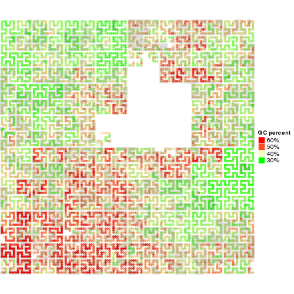</center></p>\n")
```

Or visualize GC percent on chromosome 1, under "pixel" mode (you may see the difference
between "normal" mode and "pixel" mode here):

```{r, eval = grepl("odcf", Sys.info()["nodename"]) & FALSE, fig.keep = "none", echo = 2:4}
png("gc_percent_chr1.png", width = 500, height = 500)
hc = GenomicHilbertCurve(chr = "chr1", level = 9, mode = "pixel", legend = lgd)
hc_layer(hc, df, col = col_fun(df[[5]]))
hc_layer(hc, reduce(g), col = "#00000020")
invisible(dev.off())
```

```{r, echo = FALSE, results = "asis"}
cat("<p><center>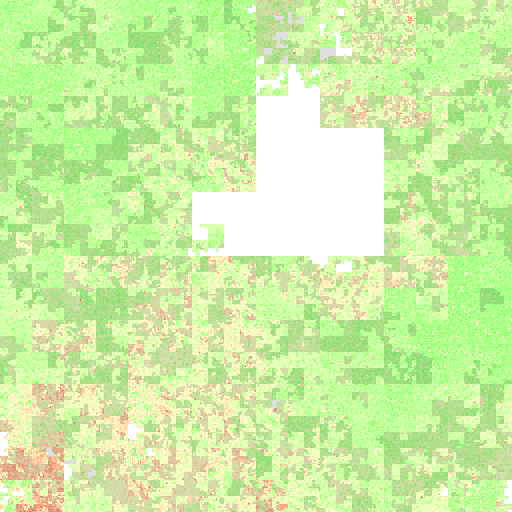</center></p>\n")
```

Background is not necessary to be the whole chromosome, it can also be self-defined regions.
The background can be specified as a `GRanges` object and pass to `background` argument. 
In following example, only the first half part of chromosome 1 is used to initialize the curve.

**Note: when using `background`, one chromosome can only exist in one row in `background`.**

```{r, eval = grepl("odcf", Sys.info()["nodename"]) & FALSE, fig.keep = "none", echo = 2:6}
png("gc_percent_half_chr1.png", width = 500, height = 500)
background = GRanges(seqnames = "chr1", ranges = IRanges(1, ceiling(chr1_len/2)))
hc = GenomicHilbertCurve(background = background, level = 9, mode = "pixel", legend = lgd,
    title = "First half of chromosome 1")
hc_layer(hc, df, col = col_fun(df[[5]]))
hc_layer(hc, reduce(g), col = "#00000020")
invisible(dev.off())
```

```{r, echo = FALSE, results = "asis"}
cat("<p><center>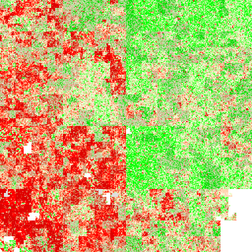</center></p>\n")
```

## Histone modifications

Different modifications (e.g. methylation, acetylation) of the histones affect
the chromatin-DNA interaction, thus play roles in transcription regulation.
Different types of modifications relates to different types of gene
regulation. E.g. H3H4me3 modification is found in actively transcribed
promoters. ChIP-sequencing (ChIPSeq) utilizes highthroughput DNA sequencing
technology to identify status of chromatin states genome-wide, thus it
provides a way to study gene regulation in a global aspect.

In this section, we visualize four types of histone modifications (H3K27ac,
H3K36me3, H3K4me3, H3K9me3). The ChIPSeq data are downloaded from Roadmap
(http://genboree.org/EdaccData/Release-9/sample-experiment/Lung/, The bed
files are alignments of reads, you need to convert to the basepair or
window-based coverage before using following R commands). Following files for
four histone modifications are used to visualize:

<pre><code>
UCSD.Lung.H3K27ac.STL002.bed
UCSD.Lung.H3K36me3.STL002.bed
UCSD.Lung.H3K4me3.STL002.bed
UCSD.Lung.H3K9me3.STL002.bed
</code></pre>

Since we are going to plot more than one histome marks, the code for plotting are wrapped as a simple function:

```{r}
library(GetoptLong)
plot_histone_mark = function(mark) {
    df = read.table(pipe(qq("awk '$5>0 && $1==\"chr1\"' ~/HilbertCurveTest/UCSD.Lung.@{mark}.STL002.bed")), 
        sep = "\t")
    col_fun = colorRamp2(c(0, quantile(df[[5]], 0.99)), c("white", "red"))
    lgd1 = Legend(col_fun = col_fun, title = "Intensity")
    lgd2 = Legend(labels = c(mark, "gene"), legend_gp = gpar(fill = c("#FF0000", "#CCCCCC")),
        title = "Layer")

    hc = GenomicHilbertCurve(chr = "chr1", level = 9, mode = "pixel", 
        title = qq("Intensity of @{mark} mark on chr1"), legend = list(lgd1, lgd2))
    hc_layer(hc, df, col = col_fun(df[[5]]))
    hc_layer(hc, reduce(g), col = "#00000010")
}
```

In above code, intensities of histone modifications are mapped to a level 9
Hilbert curve so that each pixel approximately represents a window of 950bp.
In each plot, there is an additional grey layer which represents the regions
of genes (RefSeq genes) (`g` is from `system.file("extdata", "refseq_chr1.RData", package = "HilbertCurve")`). 

H3K27ac is a mark for active enhancers which is narrow and sharp. The Hilbert
curve shows this attributes and also shows enhancers may exist in form of
clusters.

```{r, eval = grepl("odcf", Sys.info()["nodename"]) & FALSE, fig.keep = "none", echo = 2}
png("H3K27ac_chr1.png", width = 500, height = 500)
plot_histone_mark("H3K27ac")
invisible(dev.off())
```

```{r, echo = FALSE, results = "asis"}
cat("<p><center>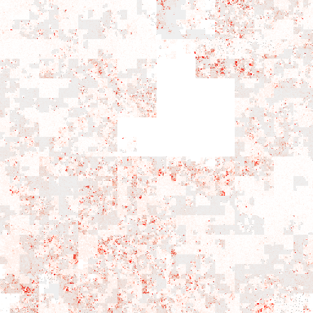</center></p>\n")
```

H3K36me3 is a mark for actively transcribed gene bodies. The Hilbert curve
shows that basically most of H3K36me3 modification with high intensity exists
as big blocks.

```{r, eval = grepl("odcf", Sys.info()["nodename"]) & FALSE, fig.keep = "none", echo = 2}
png("H3K36me3_chr1.png", width = 500, height = 500)
plot_histone_mark("H3K36me3")
invisible(dev.off())
```

```{r, echo = FALSE, results = "asis"}
cat("<p><center>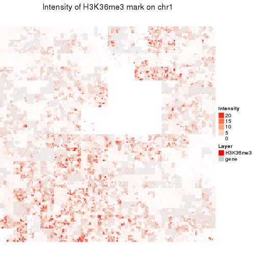</center></p>\n")
```

H3K4me3 is a mark for TSS of actively transcribed genes which is also narrow
and sharp. The Hilbert curve confirms this and also shows the size of marks
are quite consistent.

```{r, eval = grepl("odcf", Sys.info()["nodename"]) & FALSE, fig.keep = "none", echo = 2}
png("H3K4me3_chr1.png", width = 500, height = 500)
plot_histone_mark("H3K4me3")
invisible(dev.off())
```

```{r, echo = FALSE, results = "asis"}
cat("<p><center>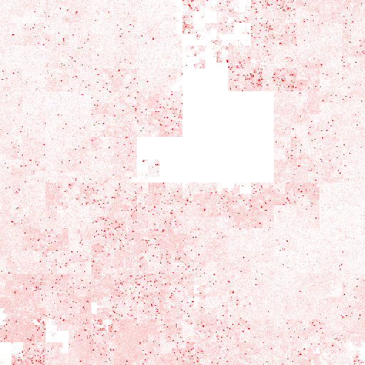</center></p>\n")
```

H3K9me3 is a mark for repressed genes. The Hilbert curve shows that H3K9me3
modications spread over huge regions in the chromosome.

```{r, eval = grepl("odcf", Sys.info()["nodename"]) & FALSE, fig.keep = "none", echo = 2}
png("H3K9me3_chr1.png", width = 500, height = 500)
plot_histone_mark("H3K9me3")
invisible(dev.off())
```

```{r, echo = FALSE, results = "asis"}
cat("<p><center>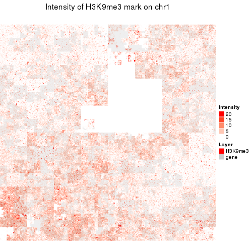</center></p>\n")
```

When there are more than one layers added and users want to see the
correspondance between different genomic features, they can define a color
overlay function to enhance the visual effects of the overlapping areas. In
following example, when regions for H3K36me3 mark are overlapped with gene
bodies, the color theme is changed to white-purple.

```{r, eval = grepl("odcf", Sys.info()["nodename"]) & FALSE, fig.keep = "none", echo = c(1:9, 11:25)}
df = read.table(pipe("awk '$5>0 && $1==\"chr1\"' ~/HilbertCurveTest/UCSD.Lung.H3K36me3.STL002.bed"), 
    sep = "\t")
col_fun = colorRamp2(c(0, quantile(df[[5]], 0.99)), c("white", "red"))
col_fun_new = colorRamp2(c(0, quantile(df[[5]], 0.99)), c("white", "purple"))
lgd1 = Legend(col_fun = col_fun, title = "Intensity")
lgd2 = Legend(labels = c("H3K36me3", "overlap", "gene"),
    legend_gp = gpar(fill = c("#FF0000", "purple", "#CCCCCC")), title = "Layer")

png("H3K36me3_chr1_overlap.png", width = 500, height = 500)
hc = GenomicHilbertCurve(chr = "chr1", level = 9, mode = "pixel",
    title = "Intensity of H3K36me3 mark on chr1", legend = list(lgd1, lgd2))
hc_layer(hc, df, col = col_fun(df[[5]]))
hc_layer(hc, reduce(g), col = "#00000010",
    overlay = function(r0, g0, b0, r, g, b, alpha) {
        l = !is_white(r0, g0, b0)
        v = col2value(r0[l], g0[l], b0[l], col_fun = col_fun)

        col_new = col_fun_new(v, return_rgb = TRUE)
        r0[l] = col_new[, 1]
        g0[l] = col_new[, 2]
        b0[l] = col_new[, 3]

        default_overlay(r0, g0, b0, r, g, b, alpha)
    })
invisible(dev.off())
```

```{r, echo = FALSE, results = "asis"}
cat("<p><center>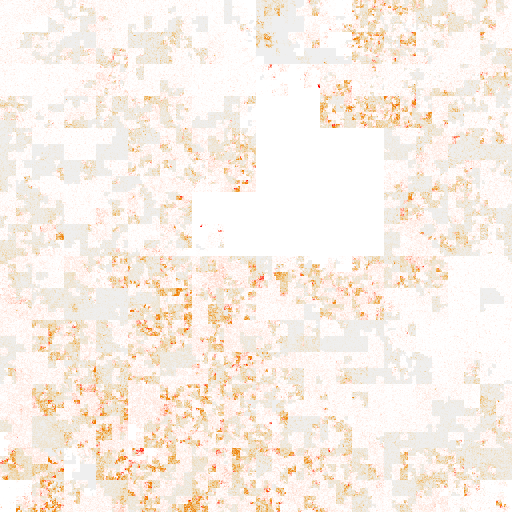</center></p>\n")
```

## Methylation

Next figure visualizs methylation on human chromosome 1. Blue corresponds to
un-methylation and red corresponds to full-methylation. One thing which is
very important here is that methylation is always measured at single CpG
sites, so the mode for averaging should be set to `absolute` in order to
sumarize mean methylation values only on CpG sites. Data are from
http://genboree.org/EdaccData/Release-9/sample-experiment/Lung/.

The methylation plot shows quite clear patterns for un-methylated regions
which are small and sharp, fully methylated regions and intermediate
methylated regions which are represented as large blocks.

```{r, eval = grepl("odcf", Sys.info()["nodename"]) & FALSE, fig.keep = "none", echo = c(1:4, 6:7)}
df = read.table(pipe("awk '$1==\"chr1\"' ~/HilbertCurveTest/UCSD.Lung.Bisulfite-Seq.STL002.bed"), 
    sep = "\t")
col_fun = colorRamp2(c(0, 0.5, 1), c("blue", "white", "red"))
lgd = Legend(col_fun = col_fun, title = "Methylation")
png("methylation_chr1.png", width = 500, height = 500)
hc = GenomicHilbertCurve(chr = "chr1", level = 9, mode = "pixel", legend = lgd)
hc_layer(hc, df, col = col_fun(df[[5]]), mean_mode = "absolute")
invisible(dev.off())
```

```{r, echo = FALSE, results = "asis"}
cat("<p><center>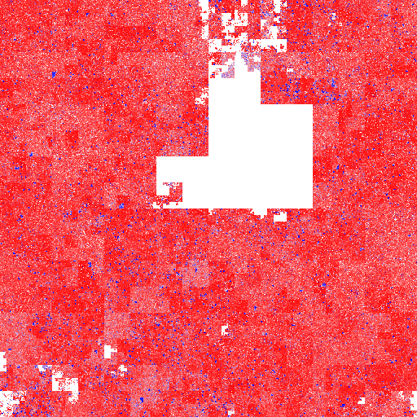</center></p>\n")
```

## Put multiple chromosomes in one curve

We demonstrated how to visualize one single chromosome through Hilbert curve,
but sometimes we also want to put all chromosomes into one plot to get a full
view of the genome. One solution is to construct a 'huge fake' chromosome
which merges all real chromosomes. `GenomicHilbertCurve()` makes it easy. You
can specify multiple chromosomes by sending a vector to `chr` argument or
specify more than one background intervals in `background` argument.

In following examples, copy number loss and gain for 22 human chromosomes are
visualized. Also color for the overlapping regions between layer for gain
events and layer for loss events is changed to purple by defining `overlay`
function. Data is from [Database of Genomic Variants, CNV
map](http://dgv.tcag.ca/dgv/app/downloads).


```{r, eval = grepl("odcf", Sys.info()["nodename"]) & FALSE, fig.keep = "none", echo = -c(1, 16)}
png("cnv_all_chromosomes.png", width = 500, height = 500)
hc = GenomicHilbertCurve(chr = paste0("chr", 1:22), level = 9, mode = "pixel")
df_gain = read.table("~/HilbertCurveTest/Stringent.Gain.hg19.2015-02-03.txt", 
    header = TRUE, stringsAsFactors = FALSE)
hc_layer(hc, df_gain, col = "red")
df_loss = read.table("~/HilbertCurveTest/Stringent.Loss.hg19.2015-02-03.txt", 
    header = TRUE, stringsAsFactors = FALSE)
hc_layer(hc, df_loss, col = "green", grid_line = 3, grid_line_col = "grey",
    overlay = function(r0, g0, b0, r, g, b, alpha) {
        l = !is_white(r0, g0, b0)
        r[l] = 160/255
        g[l] = 32/255
        b[l] = 240/255
        list(r, g, b)
})
invisible(dev.off())
```

```{r, echo = FALSE, results = "asis"}
cat("<p><center>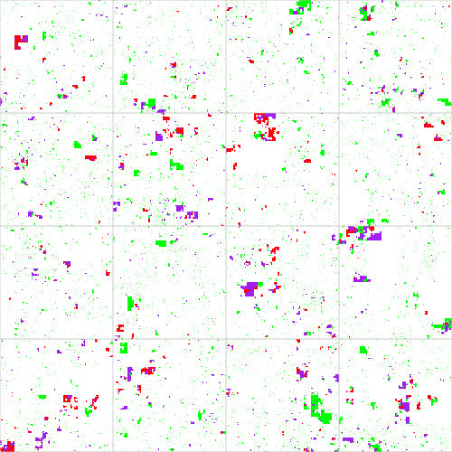</center></p>\n")
```

A map which shows the chromosome positions in Hilbert curve is very necessary
for knowing which part in the curve represents which chromosome.

```{r, eval = grepl("odcf", Sys.info()["nodename"]) & FALSE, echo = 2, fig.keep = "none"}
png('map_all_chromosomes.png', width = 500, height = 500)
hc_map(hc)
invisible(dev.off())
```

```{r, echo = FALSE, results = "asis"}
cat("<p><center></center></p>\n")
```

The map can be overlayed to the Hilbert curve for easy correspondance.

```{r, eval = grepl("odcf", Sys.info()["nodename"]) & FALSE, fig.keep = "none", echo = -c(1, 13)}
png('cnv_all_chromosomes_overlay.png', width = 500, height = 500)
hc = GenomicHilbertCurve(chr = paste0("chr", 1:22), level = 9, mode = "pixel")
hc_layer(hc, df_gain, col = "red")
hc_layer(hc, df_loss, col = "green", 
    overlay = function(r0, g0, b0, r, g, b, alpha) {
        l = !is_white(r0, g0, b0)
        r[l] = 160/255
        g[l] = 32/255
        b[l] = 240/255
        list(r, g, b)
})
hc_map(hc, add = TRUE, fill = rand_color(22, transparency = 0.8))
invisible(dev.off())
```

```{r, echo = FALSE, results = "asis"}
cat("<p><center>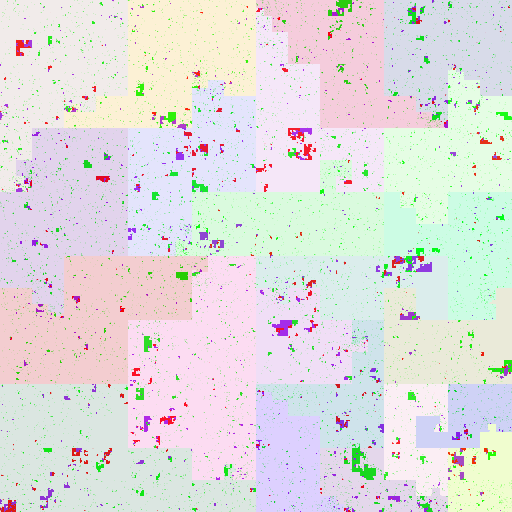</center></p>\n")
```

If colors of chromosomes defuse the colors in the original Hilbert curve, you
can only draw borders of chromosomes.

```{r, eval = grepl("odcf", Sys.info()["nodename"]) & FALSE, fig.keep = "none", echo = -c(1, 13)}
png('cnv_all_chromosomes_border.png', width = 500, height = 500)
hc = GenomicHilbertCurve(chr = paste0("chr", 1:22), level = 9, mode = "pixel")
hc_layer(hc, df_gain, col = "red")
hc_layer(hc, df_loss, col = "green",
    overlay = function(r0, g0, b0, r, g, b, alpha) {
        l = !is_white(r0, g0, b0)
        r[l] = 160/255
        g[l] = 32/255
        b[l] = 240/255
        list(r, g, b)
})
hc_map(hc, add = TRUE, fill = NA, border = "grey")
invisible(dev.off())
```

```{r, echo = FALSE, results = "asis"}
cat("<p><center>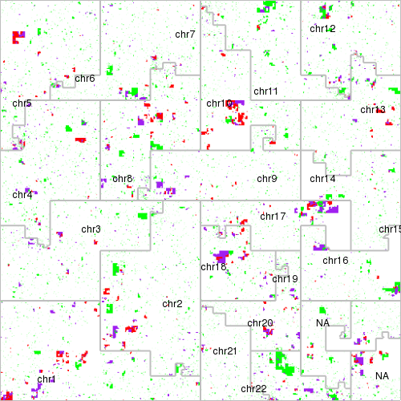</center></p>\n")
```

If you want to compare several plots simutaneously, you can use
`grid.layout()` to put them together. Remember to set `newpage` to `FALSE` in
`HilbertCurve()` or `GenomicHilbertCurve()`. Also note we set `labels` in `hc_map()`
to define the labels added to each chromosome.

```{r, eval = grepl("odcf", Sys.info()["nodename"]) & FALSE, fig.keep = "none", echo = 2:32}
png('cnv_compare.png', width = 900, height = 300)
plot_curve = function(column, ...) {
    cm = ColorMapping(levels = c("gain", "loss", "both"), color = c("red", "green", "purple"))
    hc = GenomicHilbertCurve(chr = paste0("chr", 1:22), level = 9, mode = "pixel",
        title = qq("CNV for @{column}"), ...)  ## `qq()` is from the GetoptLong package

    df = read.table("~/HilbertCurveTest/Stringent.Gain.hg19.2015-02-03.txt", header = TRUE,
        stringsAsFactors = FALSE)
    df = df[df[[column]] > 0, , drop = FALSE]
    hc_layer(hc, df, col = "red")

    df = read.table("~/HilbertCurveTest/Stringent.Loss.hg19.2015-02-03.txt", header = TRUE, 
        stringsAsFactors = FALSE)
    df = df[df[[column]] > 0, , drop = FALSE]
    hc_layer(hc, df, col = "green", 
        overlay = function(r0, g0, b0, r, g, b, alpha) {
            l = !is_white(r0, g0, b0)
            r[l] = 160/255
            g[l] = 32/255
            b[l] = 240/255
            list(r, g, b)
    })
    hc_map(hc, labels = 1:22, add = TRUE, fill = NA, border = "grey")
}

pn = c("African", "Asian", "European")
pushViewport(viewport(layout = grid.layout(nrow = 1, ncol = 3)))
for(i in seq_along(pn)) {
    pushViewport(viewport(layout.pos.row = 1, layout.pos.col = i))
    plot_curve(pn[i], newpage = FALSE)
    upViewport()
}
upViewport()

invisible(dev.off())
```

```{r, echo = FALSE, results = "asis"}
cat("<p><center>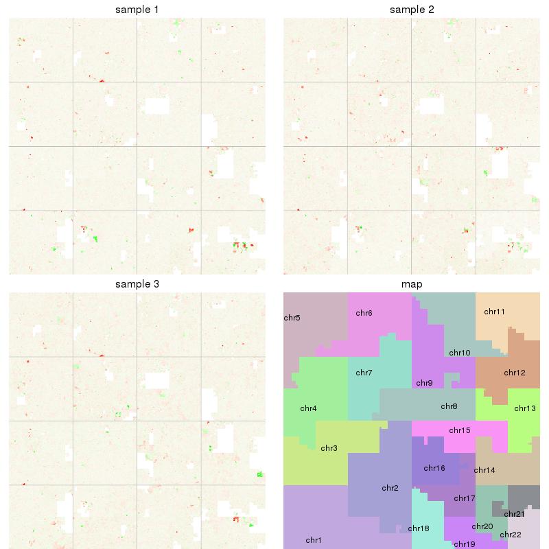</center></p>\n")
```


## Session info

```{r}
sessionInfo()
```

